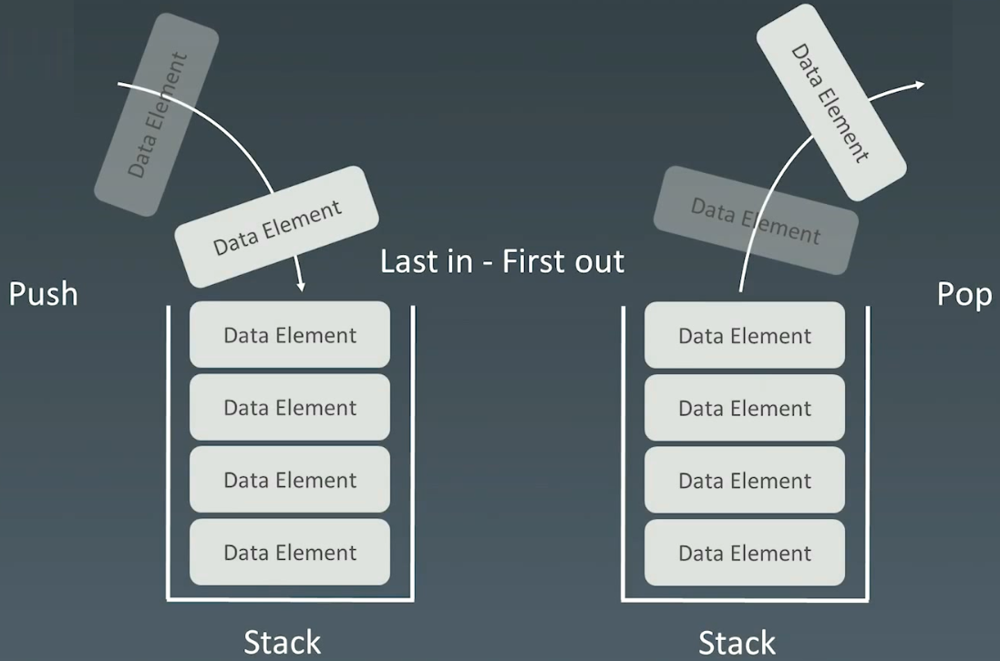
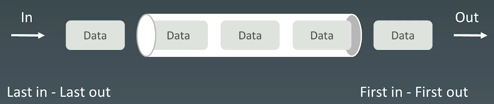
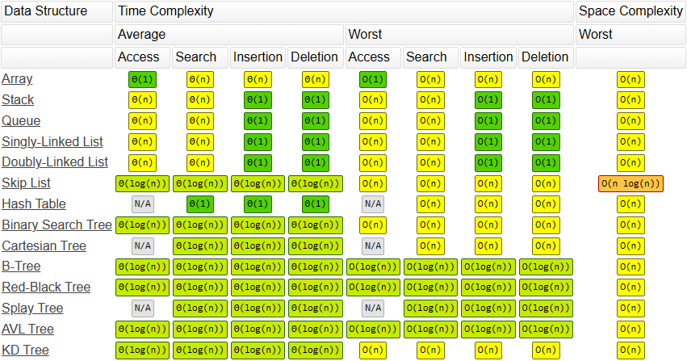

# 4.栈、队列

# 1.栈和队列的基本实现和特性

## 1.1 基本性质

Stack：**先入后出**；添加、删除为$O(1)$，查询为$O(n)$

Queue ：先入先出；添加、查询为$O(1)$

栈



队列



## 1.2 双端队列&#x20;

插入和删除是 $O(1)$，查询为 $O(n)$


## 1.3 工程实现

-   [Java 的 Stack 源码](http://developer.classpath.org/doc/java/util/Stack-source.html "Java 的 Stack 源码")
-   [Java 的 Queue 源码](http://fuseyism.com/classpath/doc/java/util/Queue-source.html "Java 的 Queue 源码")
-   [Python 的 heapq](http://docs.python.org/2/library/heapq.html "Python 的 heapq")
-   [高性能的 container 库](http://docs.python.org/2/library/collections.html "高性能的 container 库")

## 1.4 优先队列

[Java 的 PriorityQueue 文档](http://docs.oracle.com/javase/10/docs/api/java/util/PriorityQueue.html "Java 的 PriorityQueue 文档")

-   插入操作： $O(1)$
-   取出操作： $O(log~n)$，按照元素的优先级取出
-   底层具体实现的数据结构较为多样和复杂：heap、bst、treap

## 1.5 复杂度分析

[Big-O Algorithm Complexity Cheat Sheet (Know Thy Complexities!) @ericdrowell (bigocheatsheet.com)](https://www.bigocheatsheet.com/ "Big-O Algorithm Complexity Cheat Sheet (Know Thy Complexities!) @ericdrowell (bigocheatsheet.com)")



# 2.题目

## 2.1 有效括号

[20. 有效的括号 - 力扣（LeetCode）](https://leetcode.cn/problems/valid-parentheses/description/ "20. 有效的括号 - 力扣（LeetCode）")

```bash
给定一个只包括 '('，')'，'{'，'}'，'['，']' 的字符串 s ，判断字符串是否有效。

有效字符串需满足：
- 左括号必须用相同类型的右括号闭合。
- 左括号必须以正确的顺序闭合。
- 每个右括号都有一个对应的相同类型的左括号。
```

```c++
// 1.暴力求解 ： 不断replace匹配的括号 -> “ ”，直到所有字符串替换为空
//   a.()[]{}
//   b.((({[]})))
//   c. O(n^2)
// 2.栈，左括号压入栈，右括号和栈顶匹配


class Solution {
public:
    bool isValid(string s) {
        if (s.size() % 2 == 1) {
            return false;
        }
        std::stack<char> stack;

        for (auto ch : s) {
            if (ch == '(' || ch == '[' || ch == '{') {
                stack.push(ch);
            } else if (ch == ')' || ch == ']' || ch == '}') {
                if (!stack.empty() && this->judge_vaild(stack.top(), ch)) {
                    stack.pop();
                } else {
                    return false;
                }
            }
        }

        return stack.empty();
    }

private:
    bool judge_vaild(char s, char d) {
        if ((s == '(' && d == ')')
            ||  (s == '[' && d == ']')
            ||  (s == '{' && d == '}')) {
            return true;
        } else {
            return false;
        }
    }
};
```

## 2.2 最小栈

[155. 最小栈 - 力扣（LeetCode）](https://leetcode.cn/problems/min-stack/ "155. 最小栈 - 力扣（LeetCode）")

```bash
设计一个支持 push ，pop ，top 操作，并能在常数时间内检索到最小元素的栈。

实现 MinStack 类:

MinStack() 初始化堆栈对象。
void push(int val) 将元素val推入堆栈。
void pop() 删除堆栈顶部的元素。
int top() 获取堆栈顶部的元素。
int getMin() 获取堆栈中的最小元素。
```

```c++
class MinStack {
public:
    MinStack() {
        m_min_stack.push(m_min);
    }
    
    void push(int val) {
        m_stack.push(val);
        if (m_stack.size() == 0) {
            m_min = val;
        } else {
            m_min = std::min(m_min, val);
        }
        
        m_min_stack.push(m_min);
    }
    
    void pop() {
        m_stack.pop();
        m_min_stack.pop();
        m_min = m_min_stack.top();
    }
    
    int top() {
        return m_stack.top();
    }
    
    int getMin() {
        return m_min_stack.top();
    }
private:
    std::stack<int> m_stack;
    std::stack<int> m_min_stack;
    int m_min = INT_MAX;
};
```

## 2.3 柱状图

[84. 柱状图中最大的矩形 - 力扣（LeetCode）](https://leetcode.cn/problems/largest-rectangle-in-histogram/description/ "84. 柱状图中最大的矩形 - 力扣（LeetCode）")

```bash
给定 n 个非负整数，用来表示柱状图中各个柱子的高度。每个柱子彼此相邻，且宽度为 1 。

求在该柱状图中，能够勾勒出来的矩形的最大面积。

```

```c++
class Solution {
public:
    // 1.固定高度，枚举宽度， 超时
    // 固定每个数组元素为每个矩形的高，然后遍历数组，寻找每个矩形高能构成的最大面积，
    // 当左右两边第一次出现比当前高小的元素值，即为当前高能构成的最大值，每次保存最大值
    int largestRectangleArea1(vector<int>& heights) {
        int max_area = 0;
        // 遍历高度
        for (int mid = 0; mid < heights.size(); mid++) {
            int h = heights[mid];
            int left = mid;
            int right = mid;
            // 左侧寻找最大宽度 
            while (left - 1 >= 0 && heights[left - 1] >= h) {
                left--;
            }
            // 右侧寻找最大宽度
            while (right + 1 < heights.size() && heights[right + 1] >= h) {
                right++;
            }

            max_area = std::max(max_area, h * (right - left + 1));
        }
        
        return max_area;
    }

    // 2.固定宽度，枚举高度, 超时
    // 固定左右两边的长度即固定宽的长度，然后遍历数组，寻找当前长度中高最短的元素，
    // 即当前宽能构成的最大矩形，每次保存最大值
    int largestRectangleArea2(vector<int>& heights) {
        int max_area = 0;
        int n = heights.size();
        if (n == 1) {
            return heights[0];
        }
        for (int left = 0; left < n; left++) {
            int min_height = heights[left];
            for (int right = left; right < n; right++) {
                min_height = std::min(min_height, heights[right]);
                max_area = std::max(max_area, min_height * (right - left + 1));
            }
            
        }

        return max_area;
    }

    // 3.单调栈
    // 在枚举宽的同时需要寻找高，在枚举高的时候又要寻找宽，时间消耗非常大
    // 那么可以利用递增栈优化暴力暴力求解的过程

    // 当元素大于栈顶元素时，入栈
    // 当元素小于栈顶元素时，维护栈的递增性，将小于当前元素的栈顶元素弹出，并计算面积
    int largestRectangleArea(vector<int>& heights) {
        int n = heights.size();
        if (n == 1) {
            return heights[0];
        }
        
        int max_area = 0;

        std::stack<int> stack;
        // 遍历数组
        for (int i = 0; i < n; i++) {
            while (!stack.empty() && heights[stack.top()] >= heights[i]) {
                // 出栈，并计算面积，维护递增性，需要对小于的元素全部出栈
                int length = heights[stack.top()];
                stack.pop();

                int weight = i;
                // 最后一个栈顶元素，出栈计算面积需要包含一下前面和后面，
                // 因为矩形可以延伸，这里需要好好想一想
                if (!stack.empty()) {
                    weight = i - stack.top() - 1;
                }

                max_area = std::max(max_area, length * weight);

            }
            // 入栈
            stack.push(i);
        }

        // 数组元素全部遍历完了，但是栈还有元素，进行清空栈
        while (!stack.empty()) {
            int length = heights[stack.top()];
            stack.pop();
            int weight = n;
            if (!stack.empty()) {
                weight = n - stack.top() - 1;
            }
            max_area = std::max(max_area, length * weight);
        }

        return max_area;
    }
};
```

## 2.4 滑动窗口的最大值

[239. 滑动窗口最大值 - 力扣（LeetCode）](https://leetcode.cn/problems/sliding-window-maximum/description/ "239. 滑动窗口最大值 - 力扣（LeetCode）")

```bash
给你一个整数数组 nums，有一个大小为 k 的滑动窗口从数组的最左侧移动到数组的最右侧。你只可以看到在滑动窗口内的 k 个数字。滑动窗口每次只向右移动一位。

返回 滑动窗口中的最大值 。
```

```c++
vector<int> maxSlidingWindow(vector<int>& nums, int k) {
    int n = nums.size();
    std::deque<int> que;

    // 将前k个元素的下标加入队列中，其中队列头为最大值，队列尾为最小值
    for (int i = 0; i <k; i++) {
        // 将小于队列低的元素加在后面
        while (!que.empty() && nums[i] >= nums[que.back()]) {
            que.pop_back();
        }

        que.push_back(i);
    }

    // 将前k个元素的最大值加进去
    std::vector<int> ans = {nums[que.front()]};
    // 开始遍历
    for (int i = k; i < n; i++) {
        while (!que.empty() && nums[i] >= nums[que.back()]) {
            que.pop_back();
        }

        que.push_back(i);
        //
        while (que.front() <= i - k) {
            que.pop_front();
        }
        ans.push_back(nums[que.front()]);
    }

    return ans;        
}
```
