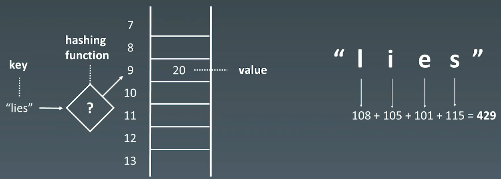

# 5.哈希表、映射、集合

# 1.基本特性

## 1.1 Hash Table

哈希表（Hash table），也叫散列表，是根据关键码值（Key value）而直接进行访问的数据结构。它通过把关键码值映射到一个位置来访问记录，以加快查找的速度。这个映射函数叫做散列函数（Hash Function），存放记录的数组叫做哈希表（或散列表）。

#### hash函数



#### hash冲突


# 2.示例

## 2.1 有效字母异位词

[242. 有效的字母异位词 - 力扣（LeetCode）](https://leetcode.cn/problems/valid-anagram/solutions/ "242. 有效的字母异位词 - 力扣（LeetCode）")

```bash
给定两个字符串 s 和 t ，编写一个函数来判断 t 是否是 s 的字母异位词。

注意：若 s 和 t 中每个字符出现的次数都相同，则称 s 和 t 互为字母异位词。
```

```c++
// 1.暴力 sort， sorted_str是否相等？ O(NlogN)
// 2.hash, map --> 统计每个字符的频次
//  第一个字符串，遇到一个字符加一，第二个字符串，遇到字符减一
class Solution {
public:
    // 1.暴力，排序
    bool isAnagram1(string s, string t) {
        std::sort(s.begin(), s.end());
        std::sort(t.begin(), t.end());

        return s == t;
    }

    // 2.hash 
    bool isAnagram(string s, string t) {
        if (s.size() != t.size()) {
            return false;
        }

        std::vector<int> counter(26, 0);
        for(int i = 0; i < s.size(); i++) {
            counter[s[i] - 'a']++;
            counter[t[i] - 'a']--;
        }

        for (auto count : counter) {
            if (count != 0) {
                return false;
            }
        }

        return true;
    }
};
```

## 2.2 字母异位词分组

[49. 字母异位词分组 - 力扣（LeetCode）](https://leetcode.cn/problems/group-anagrams/description/ "49. 字母异位词分组 - 力扣（LeetCode）")

```bash
给你一个字符串数组，请你将 字母异位词 组合在一起。可以按任意顺序返回结果列表。

字母异位词 是由重新排列源单词的所有字母得到的一个新单词。
```

```c++
// 1.排序，匹配
// 2.hash 计数
class Solution {
public:
    // 1.排序
    // 对两个字符串，排序之后得到的字符串一定是相同的，可以将排序后的字符串作为哈希表的键
    vector<vector<string>> groupAnagrams(vector<string>& strs) {
        std::unordered_map<std::string, std::vector<std::string>> map;

        for (auto& str : strs) {
            std::string key = str;
            std::sort(key.begin(), key.end());
            map[key].emplace_back(str);
        }

        std::vector<std::vector<std::string>> ans;
        for (auto it = map.begin(); it != map.end(); it++) {
            ans.emplace_back(it->second);
        }
        
        return ans;
    }

    // 2.hash 计数
    // 两个字符串中相同字母出现的次数一样，可以将每个字母出现的次数使用字符串表示，作为hash的键
    // 由于字符串只包含小写，使用长度为26的数组记录每个字母的出现次数。
    vector<vector<string>> groupAnagrams2(vector<string>& strs) {
        // 自定义 array<int, 26> 类型的哈希函数
        auto array_hash = [fn = hash<int>{}](const std::array<int, 26>& arr) -> size_t {
            return std::accumulate(arr.begin(), arr.end(), 0u, [&](size_t acc, int num) {
                return (acc << 1) ^ fn(num);
            });
        };

        std::unordered_map<std::array<int ,26>, std::vector<std::string>, decltype(array_hash)> map(0, array_hash);

        for (std::string& str : strs) {
            std::array<int ,26> counts{};
            int length = str.length();
            for (int i = 0; i < length; i++) {
                counts[str[i] - 'a']++;
            }
            map[counts].emplace_back(str);
        }

        std::vector<std::vector<std::string>> ans;
        for (auto it = map.begin(); it != map.end(); it++) {
            ans.emplace_back(it->second);
        }
        
        return ans;
    }
};
```
