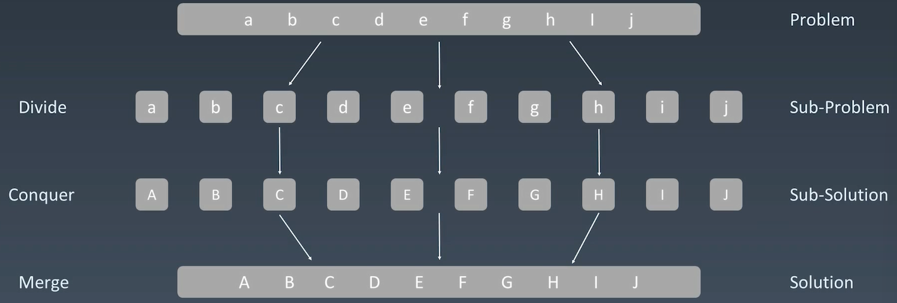

# 8.分治、回溯

# 1.分治

本质上就是一种递归

找问题**重复性**，分解问题，组合每个子问题结果

递归状态树


## 1.1 分治 Divide & Conquer



## 1.2 分治代码模板

```python
def divide_conquer(problem, param1, param2, ...):
  # recursion terminator
  if problem is None:
    print_result
    return
  
  # prepare data
  data = prepare_data(problem)
  subproblems = split_problem(problem, data)
  
  # conquer subproblems
  subresult1 = self.divide_conquer(subproblems[0], p1, ...)
  subresult1 = self.divide_conquer(subproblems[0], p1, ...)
  subresult1 = self.divide_conquer(subproblems[0], p1, ...)
  ...
  
  # process and generate the final result
  result = process_result(subresult1, subresult2, subresult3, ...)
  
  # revert the current level status
```

泛型递归代码模板

```python
def recursion(level, param1, param2, ...):
  # recursion terminator
  if level > MAX_LeVEL:
    process_result
    return
  # process logic in current level
  process(level, data, ...)
  
  # drill down
  self.recursion(level + 1, p1, ...)
  
  # reverse the current level status if needed

```

# 2.回溯

回溯法采用试错的思想，它尝试分步的去解决一个问题。在分步解决问题的过程中，当它通过尝试发现现有的分步答案不能得到有效的正确的解答的时候，它将取消上一步甚至是上几步的计算，再通过其它的可能的分步解答再次尝试寻找问题的答案。

回溯法通常用最简单的递归方法来实现，在反复重复上述的步骤后可能出现两种情况：

-   找到一个可能存在的正确的答案
-   在尝试了所有可能的分步方法后宣告该问题没有答案

在最坏的情况下，回溯法会导致一次复杂度为指数时间的计算。

最典型应用：八皇后、数独

# 3.实战题目

## 3.1 pow(x, n)

[https://leetcode.cn/problems/powx-n/](https://leetcode.cn/problems/powx-n/ "https://leetcode.cn/problems/powx-n/")

### （1）暴力 O(n)

```c++
result = 1;
for (int i = 0; i < n; i++) {
  result *= x;
}
```

### （2）分治

```c++
template:
  1. terminator
  2. process (split your big problem)
  3. drill down (subproblems), merge(subresult)
  4. reverse states

```

x^n  → 2^10 → 2^5 → (2^2)\*2

```c++
pow(x, n):
  subproblem : subresult = power(x, n/2)

merge:
  if (n % 2 == 1) {
    result = subresult * subresult * x;
  } else {
    result = subresult * subresult;
  }

```

实现代码

```c++
class Solution {
public:
    // 分治，递归
    // 2^10 --> 2^5  -> (2^2) * 2
    double fast_pow(double x, int n) {
        if (n == 0)
            return 1.0;
        double sub_result = fast_pow(x, n/2);
        return n % 2 == 0 ? sub_result * sub_result : sub_result * sub_result * x;
    }

    // 分治递归处理
    double myPow(double x, int n) {
        long long N = n;
        // 如果n是负数，特殊处理
        return N >= 0 ? fast_pow(x, N) : fast_pow(1/x, -N);
    }
};
```

### （3）牛顿迭代法

-   [牛顿迭代法原理](http://www.matrix67.com/blog/archives/361 "牛顿迭代法原理")
-   [牛顿迭代法代码](http://www.voidcn.com/article/p-eudisdmk-zm.html "牛顿迭代法代码")

## 3.2 子集

[78. 子集 - 力扣（LeetCode）](https://leetcode.cn/problems/subsets/ "78. 子集 - 力扣（LeetCode）")

### （1）递归

类似爬楼梯，可选可不选

```c++
class Solution {
public:
    void dfs(std::vector<std::vector<int>>& ans, std::vector<int>& nums, vector<int> list, int idx) {
        // terminator
        if (idx == nums.size()) {
            ans.push_back(list);
            return;
        }

        // not pick the number at this idx
        this->dfs(ans, nums, list, idx + 1);

        // pick the number at this idx
        list.push_back(nums[idx]);
        this->dfs(ans, nums, list, idx + 1);
        list.pop_back();

    }
    vector<vector<int>> subsets(vector<int>& nums) {
        std::vector<std::vector<int>> ans;
        std::vector<int> list;
        if (nums.empty())
            return ans;

        this->dfs(ans, nums, list, 0);

        return ans;
    }
};
```

### （2）迭代

```python
class Solution:
    # []

    # [1]

    # [2]
    # [1, 2]

    # [3]
    # [1, 3]
    # [2, 3]
    # [1, 2, 3]
    def subsets(self, nums: List[int]) -> List[List[int]]:
        results = [[]]

        for num in nums:
            new_sets = []
            for subset in results:
                new_subset = subset + [num]
                new_sets.append(new_subset)
            results.extend(new_sets)

        return results
```

## 3.3 众数

[https://leetcode-cn.com/problems/majority-element/description/](https://leetcode-cn.com/problems/majority-element/description/ "https://leetcode-cn.com/problems/majority-element/description/") （简单、但是高频）

### （1）哈希表

我们使用哈希映射（HashMap）来存储每个元素以及出现的次数。对于哈希映射中的每个键值对，键表示一个元素，值表示该元素出现的次数。

我们用一个循环遍历数组 nums 并将数组中的每个元素加入哈希映射中。在这之后，我们遍历哈希映射中的所有键值对，返回值最大的键。我们同样也可以在遍历数组 nums 时候使用打擂台的方法，维护最大的值，这样省去了最后对哈希映射的遍历。

```c++
class Solution {
public:
    // 哈希表映射法
    int majorityElement(vector<int>& nums) {
        std::unordered_map<int, int> counts;
        int majority = 0;
        int max_cnt = 0;

        for (int num : nums) {
            counts[num]++;
            if (counts[num] > max_cnt) {
                majority = num;
                max_cnt = counts[num];
            }
        }

        return majority;
    }
};
```

## 3.3 电话号码的字母组合

[https://leetcode-cn.com/problems/letter-combinations-of-a-phone-number/](https://leetcode-cn.com/problems/letter-combinations-of-a-phone-number/ "https://leetcode-cn.com/problems/letter-combinations-of-a-phone-number/")


## 3.4 N皇后

[https://leetcode-cn.com/problems/n-queens/](https://leetcode-cn.com/problems/n-queens/ "https://leetcode-cn.com/problems/n-queens/")


