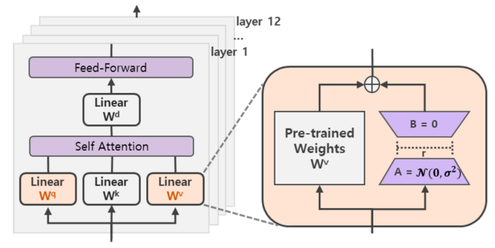
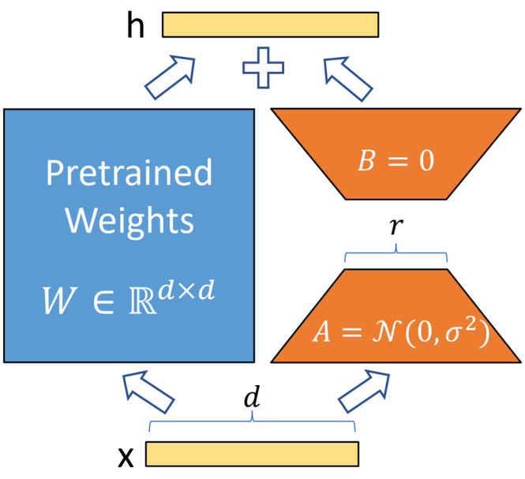

# 2.LoRA微调

### 1.LoRA

#### 1.1 背景

神经网络包含很多全连接层，其借助于矩阵乘法得以实现，然而，很多全连接层的权重矩阵都是满秩的。当针对特定任务进行微调后，**模型中权重矩阵其实具有很低的本征秩**（intrinsic rank），因此，论文的作者认为**权重更新的那部分参数矩阵尽管随机投影到较小的子空间，仍然可以有效的学习，可以理解为针对特定的下游任务这些权重矩阵就不要求满秩**。

#### 1.2 技术原理

LoRA（论文：**LoRA: LOW-RANK ADAPTATION OF LARGE LANGUAGE MODELS**），该方法的核心思想就是**通过低秩分解来模拟参数的改变量，从而以极小的参数量来实现大模型的间接训练。**

在涉及到矩阵相乘的模块，在原始的PLM旁边增加一个新的通路，通过前后两个矩阵A,B相乘，第一个矩阵A负责降维，第二个矩阵B负责升维，中间层维度为r，从而来模拟所谓的本征秩（intrinsic rank）。



可训练层维度和预训练模型层维度一致为`d`，先将维度`d`通过全连接层降维至`r`，再从`r`通过全连接层映射回`d`维度，其中，`r<<d`，r是矩阵的秩，这样矩阵计算就从`d x d`变为`d x r + r x d`，参数量减少很多。



在下游任务训练时，固定模型的其他参数，只优化新增的两个矩阵的权重参数，将PLM跟新增的通路两部分的结果加起来作为最终的结果（两边通路的输入跟输出维度是一致的），即`h=Wx+BAx`。第一个矩阵的A的权重参数会通过高斯函数初始化，而第二个矩阵的B的权重参数则会初始化为零矩阵，这样能保证训练开始时新增的通路BA=0从而对模型结果没有影响。

$$
h=W_{0} x+\Delta W x=W_{0} x+B A x
$$

在推理时，将左右两部分的结果加到一起即可，`h=Wx+BAx=(W+BA)x`，所以只要将训练完成的矩阵乘积`BA`跟原本的权重矩阵`W`加到一起作为新权重参数替换原本PLM的W即可，对于推理来说，不会增加额外的计算资源。

此外，Transformer的权重矩阵包括Attention模块里用于计算`query`, `key`, `value`的`Wq`，`Wk`，`Wv`以及多头attention的`Wo`,以及MLP层的权重矩阵，LoRA只应用于Attention模块中的4种权重矩阵，而且通过消融实验发现同时调整 `Wq `和 `Wv` 会产生最佳结果。

实验还发现，**保证权重矩阵的种类的数量比起增加隐藏层维度r更为重要**，增加r并不一定能覆盖更加有意义的子空间。

那么关于秩的选择，通常情况下，`rank`为4，8，16即可。

通过实验也发现，在众多数据集上LoRA在只训练极少量参数的前提下，最终在性能上能和全量微调匹配，甚至在某些任务上优于全量微调。

### 2.在 transformer 中使用 LoRA

Transformer 中有 multi-head attention 和 ffn 两部分。其中 multi-head attention 中有四个权重矩阵，分别记为 `Wq`、`Wk`、`Wv`、`Wo`，`ffn` 中有两个权重矩阵。其中 `Wq`、`Wk`、`Wv` 在实际运算时是多头计算的，这里也直接将其看做维度为 `dmodel∗dmodel` 的矩阵。

只考虑在 mutil-head attention 中使用 LoRA。至于 ffn 以及模型中的 LayerNorm 部分，使用 LoRA 进行微调能够取得什么效果，没有做研究。

在 transformer 中使用 LoRA 应该说是实际工程中最关心的部分，从以下两个方面来确定使用 LoRA 的细节：

-   在给定参数量预算的情况下，应该对 transformer 中的哪些层使用 LoRA 可以取得最优效果？（所谓给定参数量预算就是指所有 LoRA 模块加起来的参数量是固定的，因为参数量越多需要的计算资源就越多，所以研究固定参数量情况如何取得最优结果是有必要的）
-   LoRA 部分的秩 r 如何选取？

**给定参数量预算，应该作用到 transformer 哪些层?**

选取的模型是 175B 参数量的 GPT-3 模型，给 LoRA 设定的参数量预算为 18M，然后是对 multi-head attention 中的 `Wq`、`Wk`、`Wv`、`Wo` 分别进行实验。如果只对这四层中的某一层使用 LoRA 那么秩 `r` 为8；如果对其中的两层使用 LoRA，那么为了保证参数量不变，此时秩 `r` 就为4。

实验结果如下表1所示，其中：

-   前四列分别表示只对 `Wq`、`Wk`、`Wv`、`Wo` 这四个层中的某一层使用 LoRA 进行训练，秩为8；
-   第五列表示同时对 `Wq` 和 Wk 这两层使用 LoRA 进行训练，秩为4；
-   第六列表示同时对 `Wq` 和 `Wv` 这两层使用 LoRA 进行训练，秩为4；
-   第七列表示同时对 `Wq`、`Wk`、`Wv`、`Wo` 这四层使用 LoRA 进行训练，秩为2；

可以看出最好的效果是**同时对四层使用 LoRA 进行训练，其次是对 Wq 和 Wv 这两层使用 LoRA 进行训练**。也就是说相比于对单一的层使用较大的秩，对更多的层使用较小的秩的效果更好。

**秩 r 如何选取**

-   **结论1**：适配更多的权重矩阵（Wo, Wk, Wq, Wv）比适配具有较大秩的单一类型的权重矩阵表现更好。
-   **结论2**：增加秩不一定能够覆盖一个更有意义的子空间，一个低秩的适配矩阵可能已经足够了。

### 3.代码说明

在整个计算图中，一个 Linear 权重矩阵可以看做是图中的一个节点。项目 [peft](https://github.com/huggingface/peft "peft") 中实现 LoRA 的思路是这样的，PyTorch 中的 `torch.nn.Linear` 表示图1中 "蓝色的矩阵 W"，然后 [peft](https://github.com/huggingface/peft "peft") 中自己继承 `torch.nn.Linear` 实现了一个新的类 `LoraLinear`，该类表示图1中 "蓝色的矩阵 W"、"橙色的矩阵 A"、以及 "橙色的矩阵 B"，也就是图1中的三个权重矩阵都在 `LoraLinear` 中实现了。定义了该类之后，只需要在计算图中将对象 `torch.nn.Linear` 替换为 `LoraLinear` 就可以了。

以上是 [peft](https://github.com/huggingface/peft "peft") 中如何实现 LoRA 的简单说明，下面是细节说明。

这部分的代码都是从 [https://github.com/huggingface/peft/blob/v0.3.0/src/peft/tuners/lora.py](https://github.com/huggingface/peft/blob/v0.3.0/src/peft/tuners/lora.py "https://github.com/huggingface/peft/blob/v0.3.0/src/peft/tuners/lora.py") 中摘取出来的。这里的目的是整体了解一下 LoRA，所以下述代码做了部分的删减和改写。

#### 3.1 自定义的 `LoraLinear` 类

自定义一个 `LoraLinear` 类，该类是在 PyTorch 的 `torch.nn.Linear` 的基础上增加 LoRA 的功能，下面分别说明该类的初始化和前向传播过程。在项目 [peft](https://github.com/huggingface/peft "peft") 中这个类的名字叫 `Linear`，在这里为了和 `torch.nn.Linear` 做区分，这里使用名字 `LoraLinear`。

在 `LoraLinear` 中有两部分功能，一部分是其父类 `torch.nn.Linear` 的功能，另一部分是新增的 LoRA 的功能。其父类的功能这一块比较清晰，因为都是 `torch.nn.Linear` 的功能，在代码中有两个地方体现：

-   在 `__init__` 函数中调用其父类的init函数做初始化；
-   使用 `LoraLinear` 替换模型中原始 `torch.nn.Linear` 时，将原始的线性层的权重赋值给 `LoraLinear`，对应的代码为 `new_module.weight = old_module.weight`，这部分操作的细节在下面的 **3.2 使用 LoRA 对象替换原对象** 小节；

另一部分功能是新增的 LoRA 的功能，其在代码中的体现主要是初始化部分和前向传播部分。初始化部分好说，如下述代码，直接将 LoRA 相关的配置存储起来即可。

```
class LoraLinear(nn.Linear):

    def __init__(self, in_features: int, out_features: int):
        nn.Linear.__init__(self, in_features, out_features, **kwargs)
        self.r = ...
        self.lora_alpha = ...
        self.scaling = ...
        self.lora_dropout = ...
        self.lora_A = ...
        self.lora_B = ...

        self.in_features = in_features
        self.out_features = out_features
        ... ...

```

下面是前向传播的代码，核心就是三部分：**主干模型做前向传播、LoRA 模型做前向传播、将两部分前向传播结果相加**。在下面的代码块中，每行代码和注释的对应关系是比较清晰的。然后是对应一下代码和公式之间的关系：

-   代码中的 `result` 就是公式中的 Wx；
-   代码中的 `lora_result` 就是公式中的 BAx；
-   代码中的 `final_result` 就是将上述两个结果相加，即 h=Wx+BAx；

```
class LoraLinear(nn.Linear):

    def forward(self, x: torch.Tensor):
        ... ...

        # 这个就是执行的 torch.nn.Linear 的功能，对应的模型结构就是主干部分的模型结构；
        result = F.linear(x, transpose(self.weight, self.fan_in_fan_out), bias=self.bias)

        x = x.to(self.lora_A.weight.dtype)
        
        # 这一部分是 LoRA 部分的模型结构；
        # 可以看出主干部分和 LoRA 部分的输入是相同的，都是 x
        lora_result = self.lora_B(self.lora_A(self.lora_dropout(x))) * self.scaling

        # 将主干部分的输出和 LoRA 部分的输出直接相加作为最终输出
        final_result = result + lora_result
        ... ...

```

### 3.2 使用 LoRA 对象替换原对象

使用上一小节中自定义的 `LoraLinear` 这个对象替换模型中的 `torch.nn.Linear` 对象。主要的步骤如下述代码所示，说明都放在注释中了：

```
# 获取想要使用 LoRA 训练的层的信息。这里的 key 和 module_name 是有区别的，举例说明：
#   比如 key 为 transformer.layers.0.attention.query，那么 module_name 为 query
parent_module, old_module, module_name = _get_submodules(model, key)

# 创建一个自定义的带有 LoRA 功能的对象：LoraLinear
in_features, out_features = old_module.in_features, old_module.out_features
new_module = LoraLinear(in_features, out_features, bias=bias, **kwargs)

# 用上述创建的自定义的对象替换原来的模型层
setattr(parent_module, module_name, new_module)   # 更换计算图中的节点
new_module.weight = old_module.weight
if getattr(old_module, "state", None) is not None:
    new_module.state = old_module.state
    new_module.to(old_module.weight.device)

```

### 3.3 PEFT中LoraConfig参数介绍

-   **`r`**: lora的秩，矩阵A和矩阵B相连接的宽度，$r≪d$；
-   **`lora_alpha`**: 归一化超参数，lora参数 $ΔWx$ 会以 $\frac{\alpha}{r}$ 归一化，以便减小改变 `r` 时需要重新训练的计算量；
-   `lora_dropout`: lora层的dropout比率；
-   `merge_weights`: eval模式，是否将lora矩阵的值加到原有 `W0` 的值上；
-   `fan_in_fan_out`: 只有应用在 Conv1D 层时置为True，其他情况为False；
-   `bias`: 是否可训练bias；
-   `modules_to_save`: 除了lora部分外，还有哪些层可以被训练，并且需要保存；
