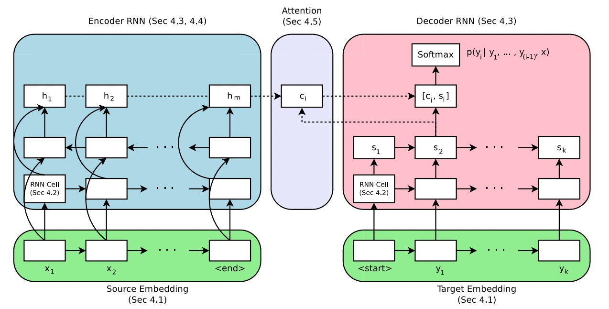

# 注意力 Attention

## 1.理论

### 1.1 直观理解



From：https://arxiv.org/pdf/1703.03906.pdf


From: https://github.com/google/seq2seq

### 1.2 Attention 计算

加性Attention，如（Bahdanau attention）：

$$
\boldsymbol{v}_a^{\top} \tanh \left(\boldsymbol{W}_{\mathbf{1}} \boldsymbol{h}_t+\boldsymbol{W}_{\mathbf{2}} \overline{\boldsymbol{h}}_s\right)
$$

乘性Attention，如（Luong attention）：

$$
\operatorname{score}\left(\boldsymbol{h}_{t}, \overline{\boldsymbol{h}}_{s}\right)=\left\{\begin{array}{ll}
\boldsymbol{h}_{t}^{\top} \overline{\boldsymbol{h}}_{s} & \text { dot } \\
\boldsymbol{h}_{t}^{\top} \boldsymbol{W}_{a} \overline{\boldsymbol{h}}_{s} & \text { general } \\
\boldsymbol{v}_{a}^{\top} \tanh \left(\boldsymbol{W}_{a}\left[\boldsymbol{h}_{t} ; \overline{\boldsymbol{h}}_{s}\right]\right) & \text { concat }
\end{array}\right.
$$

### 1.3 自注意力

#### （1）自注意力计算

"Attention is All You Need" 这篇论文提出了Multi-Head Self-Attention，是一种：Scaled Dot-Product Attention。

$$
\operatorname{Attention}(Q, K, V)=\operatorname{softmax}\left(\frac{Q K^T}{\sqrt{d_k}}\right) V
$$

From：https://arxiv.org/pdf/1706.03762.pdf

#### （2）缩放 Scaled

Scaled 的目的是调节内积，使其结果不至于太大（太大的话softmax后就非0即1了，不够“soft”了）。

From: https://kexue.fm/archives/4765

#### （3）Multi-Head


Multi-Head可以理解为多个注意力模块，期望不同注意力模块“注意”到不一样的地方，类似于CNN的Kernel。

>Multi-head attention allows the model to jointly attend to information from different representation
subspaces at different positions.

$$
\begin{aligned}
\operatorname{MultiHead}(Q, K, V) & =\operatorname{Concat}\left(\operatorname{head}_1, \ldots, \text { head }_{\mathrm{h}}\right) W^O \\
\text { where head }_{\mathrm{i}} & =\operatorname{Attention}\left(Q W_i^Q, K W_i^K, V W_i^V\right)
\end{aligned}
$$

From: https://arxiv.org/pdf/1706.03762.pdf

## 2.实践

### 2.1 包导入


```python
from dataclasses import dataclass
import torch
import torch.nn as nn
import torch.nn.functional as F
```


```python
from mha import MultiHeadAttention
```

### 2.2 模型

只用一个核心的SelfAttention模块（可支持Single-Head或Multi-Head），来学习理解Attention机制。


```python
class Model(nn.Module):
    
    def __init__(self, nhead, vocab_size, embedding_dim, num_labels, dropout=0.1):
        super().__init__()
        self.emb = nn.Embedding(vocab_size, embedding_dim)
        self.attn = MultiHeadAttention(nhead, embedding_dim, dropout)
        self.fc = nn.Linear(embedding_dim, num_labels)
    
    def forward(self, x):
        batch_size, seq_len = x.shape
        h = self.emb(x)
        attn_score, h = self.attn(h)
        h = F.avg_pool1d(h.permute(0, 2, 1), seq_len, 1)
        h = h.squeeze(-1)
        logits = self.fc(h)

        return attn_score, logits
```


```python
# 参数设置
vocab_size: int = 5000
embedding_dim: int = 512
num_heads: int = 16
dropout: float = 0.1

num_labels: int = 2

max_seq_len: int = 512

num_epochs: int = 10
```


```python
model = Model(num_heads, vocab_size, embedding_dim, num_labels, dropout)
```


```python
x = torch.randint(0, 5000, (3, 30))
x.shape
```


    torch.Size([3, 30])


```python
attn, logits = model(x)
attn.shape, logits.shape
```


    (torch.Size([3, 16, 30, 30]), torch.Size([3, 2]))

### 2.3 数据

#### （1）读取数据


```python
import pandas as pd
from sklearn.model_selection import train_test_split
```


```python
file_path = "datasets/ChnSentiCorp_htl_all.csv"

df = pd.read_csv(file_path)
df = df.dropna()
```


```python
df.head(), df.shape
```


    (   label                                             review
     0      1  距离川沙公路较近,但是公交指示不对,如果是"蔡陆线"的话,会非常麻烦.建议用别的路线.房间较...
     1      1                       商务大床房，房间很大，床有2M宽，整体感觉经济实惠不错!
     2      1         早餐太差，无论去多少人，那边也不加食品的。酒店应该重视一下这个问题了。房间本身很好。
     3      1  宾馆在小街道上，不大好找，但还好北京热心同胞很多~宾馆设施跟介绍的差不多，房间很小，确实挺小...
     4      1               CBD中心,周围没什么店铺,说5星有点勉强.不知道为什么卫生间没有电吹风,
     (7765, 2))


```python
df.label.value_counts()
```


    label
    1    5322
    0    2443
    Name: count, dtype: int64


数据不均衡，采样


```python
df = pd.concat([df[df.label==1].sample(2500), df[df.label==0]])
df.shape
```


    (4943, 2)


```python
df.label.value_counts()
```


    label
    1    2500
    0    2443
    Name: count, dtype: int64


#### （2）Tokenizer


```python
from tokenizer import Tokenizer
```


```python
tokenizer = Tokenizer(vocab_size=vocab_size, max_seq_len=max_seq_len)
```


```python
tokenizer.build_vocab(df.review)
```

    Building prefix dict from the default dictionary ...
    Loading model from cache C:\Users\dd\AppData\Local\Temp\jieba.cache
    Loading model cost 0.470 seconds.
    Prefix dict has been built successfully.


```python
tokenizer(["你好", "你好呀"])
```


    tensor([[4436,    0,    0,  ...,    0,    0,    0],
            [4436, 1012,    0,  ...,    0,    0,    0]])


#### （3）数据加载


```python
def collate_batch(batch):
    label_list, text_list = [], []
    for v in batch:
        _label = v["label"]
        _text = v["text"]
        label_list.append(_label)
        text_list.append(_text)
    inputs = tokenizer(text_list)
    labels = torch.LongTensor(label_list)
    return inputs, labels
```


```python
from dataset import Dataset

ds = Dataset()
ds.build(df, "review", "label")
```


```python
len(ds), ds[0]
```


    (4943,
     {'text': '4月份回青岛顺便带朋友去玩的，为他们选择的就是该酒店，房间干净整洁，但是卫生间的设施太简陋，房间内有小冰箱，考虑的比较周到，如果卫生间设备好一点就更好了！服务人员的态度非常好，没有给我们青岛人丢脸，电话随叫随到。',
      'label': 1})


```python
train_ds, test_ds = train_test_split(ds, test_size=0.2)
train_ds, valid_ds = train_test_split(train_ds, test_size=0.1)
len(train_ds), len(valid_ds), len(test_ds)
```


    (3558, 396, 989)


```python
from torch.utils.data import DataLoader
```


```python
BATCH_SIZE = 8
```


```python
train_dl = DataLoader(train_ds, batch_size=BATCH_SIZE, collate_fn=collate_batch)
valid_dl = DataLoader(valid_ds, batch_size=BATCH_SIZE, collate_fn=collate_batch)
test_dl = DataLoader(test_ds, batch_size=BATCH_SIZE, collate_fn=collate_batch)
len(train_dl), len(valid_dl), len(test_dl)
```


    (445, 50, 124)


```python
for v in train_dl: break
```


```python
v[0].shape, v[1].shape, v[0].dtype, v[1].dtype
```


    (torch.Size([8, 512]), torch.Size([8]), torch.int64, torch.int64)


### 2.4 训练


```python
from trainer import train, test
```


```python
NUM_EPOCHS = 10
device = torch.device("cuda:0" if torch.cuda.is_available() else "cpu")

# 参数设置
vocab_size: int = 5000
embedding_dim: int = 64
num_heads: int = 2
dropout: float = 0.1
num_labels: int = 2

max_seq_len: int = 512
num_epochs: int = 10

model = Model(num_heads, vocab_size, embedding_dim, num_labels, dropout)
model.to(device)
optimizer = torch.optim.Adam(model.parameters(), lr=1e-3, weight_decay=1e-3)
train(model, optimizer, train_dl, valid_dl, num_epochs)

test(model, test_dl)
```

    Epoch [1/10]
    Iter: 445,  Train Loss: 0.60,  Train Acc: 0.75,  Val Loss: 0.49,  Val Acc: 0.77
    Epoch [2/10]
    Iter: 890,  Train Loss: 0.52,  Train Acc: 0.75,  Val Loss: 0.47,  Val Acc: 0.77
    Epoch [3/10]
    Iter: 1335,  Train Loss: 0.50,  Train Acc: 0.75,  Val Loss: 0.45,  Val Acc: 0.78
    Epoch [4/10]
    Iter: 1780,  Train Loss: 0.45,  Train Acc: 0.75,  Val Loss: 0.44,  Val Acc: 0.79
    Epoch [5/10]
    Iter: 2225,  Train Loss: 0.47,  Train Acc: 0.88,  Val Loss: 0.42,  Val Acc: 0.82
    Epoch [6/10]
    Iter: 2670,  Train Loss: 0.40,  Train Acc: 0.88,  Val Loss: 0.40,  Val Acc: 0.84
    Epoch [7/10]
    Iter: 3115,  Train Loss: 0.34,  Train Acc: 0.88,  Val Loss: 0.38,  Val Acc: 0.84
    Epoch [8/10]
    Iter: 3560,  Train Loss: 0.30,  Train Acc: 0.88,  Val Loss: 0.36,  Val Acc: 0.86
    Epoch [9/10]
    Iter: 4005,  Train Loss: 0.29,  Train Acc: 0.88,  Val Loss: 0.35,  Val Acc: 0.87
    Epoch [10/10]
    Iter: 4450,  Train Loss: 0.30,  Train Acc: 0.88,  Val Loss: 0.34,  Val Acc: 0.87

    0.815187478500172


### 2.5 推理


```python
from inference import infer
import numpy as np
```


```python
sample = np.random.choice(test_ds)
while len(sample["text"]) > 20:
    sample = np.random.choice(test_ds)

print(sample)

inp = sample["text"]
inputs = tokenizer(inp)
attn, prob = infer(model, inputs.to(device))
attn_prob = attn[0, 0, :, :].cpu().numpy()
tokens = tokenizer.tokenize(inp)
tokens, prob
```

    {'text': '很适宜居住，环境幽静，服务台较好。我满意', 'label': 1}

    (['很', '适宜', '居住', '，', '环境', '幽静', '，', '服务台', '较', '好', '。', '我', '满意'], 1)


```python
import matplotlib.pyplot as plt
from matplotlib import rcParams
import numpy as np

rcParams['font.family'] = 'SimHei'

def plot_attention(attention_weights, source_words, target_words):
    plt.figure(figsize=(10, 8))
    plt.imshow(attention_weights, interpolation='nearest', cmap='Blues')
    
    plt.xlabel('Source')
    plt.ylabel('Target')

    plt.xticks(np.arange(0, len(source_words)), source_words, rotation=45)
    plt.yticks(np.arange(0, len(target_words)), target_words)
    
    plt.colorbar()
    plt.tight_layout()
    # plt.savefig("a.png")
    plt.show()
    
```


```python
plot_attention(attn_prob, tokens, tokens)
```

```python
tokenizer.get_freq_of("不")
```


    2682


```python

```
