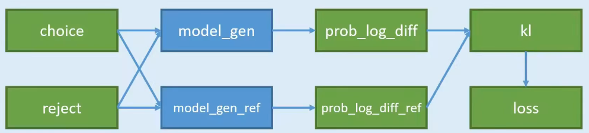

# DPO方法训练大语言模型,简易实现代码


## DPO训练方法，共分为两个步骤

1. 传统语言模型
2. DPO强化学习训练

DPO训练方法



1. 对一个问题，有两个回答 choice 和 reject，不是一个一定正确，一个一定不正确；而是训练出的语言模型，更加prefer哪一种，即希望语言模型以哪一种方式来回答。
2. 准备两个模型 model_gen 和 model_gen_ref，其实是一摸一样的模型，只不过在训练过程中，只会训练其中一个，另外一个是不训练的。
3. 把两两份数据，分别输入到两个模型中计算，可以得到4份概率；
4. 4份数据中，其中有2份是想要的，2份是不想要的；2份想要的做差，得到`pro_log_diff`，两份不想要的做差 `pro_log_diff_ref`
5. 拿2份做差的数据，计算KL散度；惩罚policy模型对正样本概率的下降和负样本概率的上升
6. 以KL散度计算Loss

文件夹结构

```shell
train_gen.ipynb # 传统语言模型训练
train_dpo.ipynb # dpo强化学习训练
test.ipynb      # 测试
common.ipynb    # 公共组件
dpo.model       # 训练好的模型
gen.model       # 训练好的模型

```

设计问题和回答

- 问题:15+12=
- 答案:27

这种问答太过于死板,所以我逆转了问答方向
- 问题:27=
- 答案: 15+12

当模型能回答此类问题时,需要另一种回答模式,以让模型学习新的回答方法,
比如:
- 问题: 27=
- 就答案:15+12
- 新答案:15+10+2


环境信息:

python=3.10

torch==2.1.0(cuda)

transformers==4.34.0

datasets==2.14.5

trl==0.7.2

视频课程:https://www.bilibili.com/video/BV1Fa4y1X7xh
