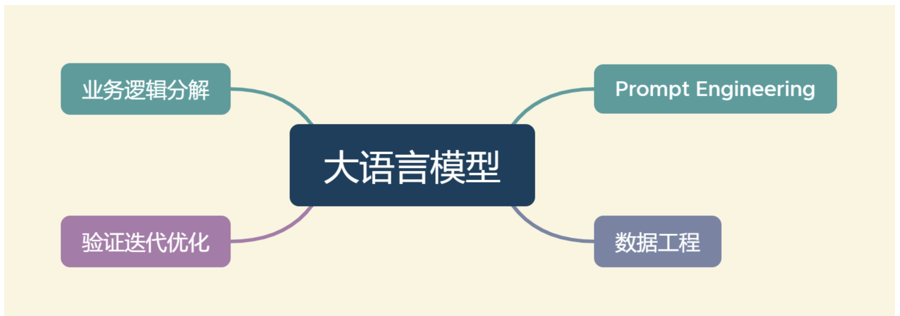
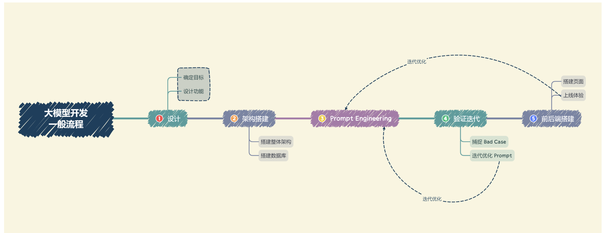
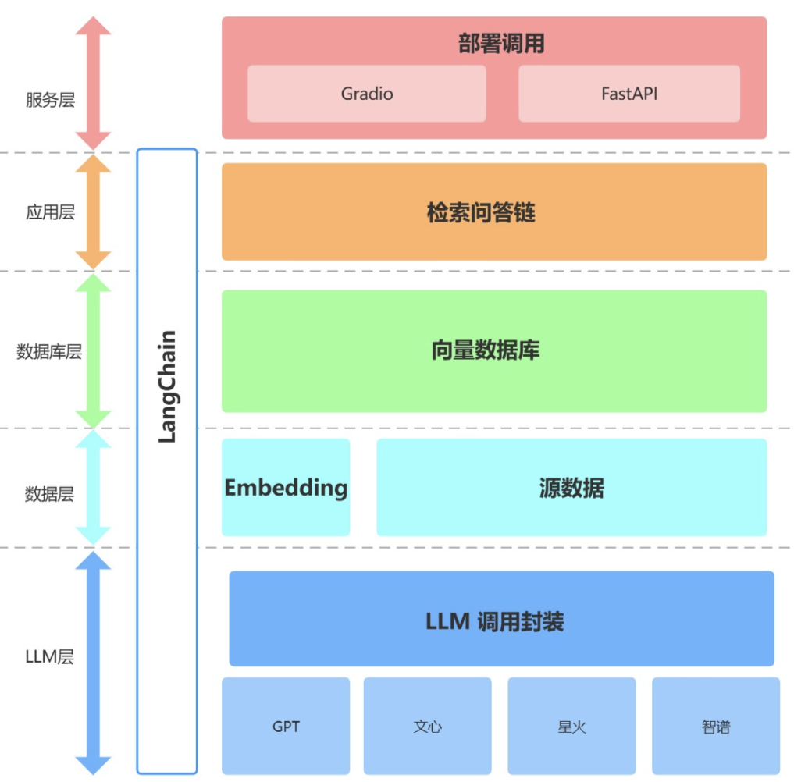

# 大模型开发整体流程-基于个人知识库的问答助手

## 1.大模型开发整体流程

### 1.1 简介

#### 定义

将**开发以LLM为功能核心**，通过LLM的强大理解能力和生成能力，结合特殊的数据或业务逻辑来提供独特功能的应用。

#### 核心点

- 通过调用 API 或开源模型来实现核心的理解与生成
- 通过 Prompt Enginnering 来实现大语言模型的控制

在大模型开发中，一般不会去大幅度改动模型，而是将大模型作为一个调用工具。通过 **Prompt Engineering**、数据工程、业务逻辑分解等手段来充分发挥大模型能力，适配应用任务，而不会将精力聚焦在优化模型本身上。这因此，作为大模型开发的初学者，并不需要深研大模型内部原理，而更需要掌握使用大模型的实践技巧。



#### 核心能力

**指令理解与文本生成**，提供了复杂业务逻辑的简单平替方案。

|          | 传统 AI                                                      | 大模型开发                                                   |
| -------- | ------------------------------------------------------------ | ------------------------------------------------------------ |
| 开发     | 将复杂业务逻辑拆解，对于每一个子业务构造训练数据与验证数据，训练优化模型，形成完整的模型链路来解决整个业务逻辑。 | 用 Prompt Engineering 来替代子模型的训练调优。通过 Prompt 链路组合来实现业务逻辑，用一个通用大模型 + 若干业务 Prompt 来解决任务 |
| 评估思路 | 训练集上训练、测试集调优、验证集验证                         | 初始化验证集Prompt、收集BadCase、迭代优化Prompt              |

### 1.2 大模型开发整体流程

  

**1. 设计**

- **确定目标** ：在进行开发前，首先需要确定开发的目标，即要开发的应用的应用场景、目标人群、核心价值。对于个体开发者或小型开发团队而言，一般应先设定最小化目标，从构建一个 mvp（最小可行性产品）开始，逐步进行完善和优化。
- **设计功能** ：在确定开发目标后，需要设计本应用所要提供的功能，以及每一个功能的大体实现逻辑。虽然通过使用大模型来简化了业务逻辑的拆解，但是越清晰、深入的业务逻辑理解往往也能带来更好的 Prompt 效果。同样，对于个体开发者或小型开发团队来说，首先要确定应用的核心功能，然后延展设计核心功能的上下游功能；例如，想打造一款个人知识库助手，那么核心功能就是结合个人知识库内容进行问题的回答，那么其上游功能的用户上传知识库、下游功能的用户手动纠正模型回答就是我们也必须要设计实现的子功能。

**2. 架构搭建**

- **搭建整体架构**：目前，绝大部分大模型应用都是采用的特定数据库+ Prompt + 通用大模型的架构。需要针对我们所设计的功能，搭建项目的整体架构，实现从用户输入到应用输出的全流程贯通。一般来说，推荐基于 LangChain 框架进行开发。LangChain 提供了 Chain、Tool 等架构的实现，可以基于 LangChain 进行个性化定制，实现从用户输入到数据库再到大模型最后输出的整体架构连接。
- **搭建数据库**：个性化大模型应用需要有个性化数据库进行支撑。由于大模型应用需要进行向量语义检索，一般使用诸如 chroma 的向量数据库。在该步骤中，需要收集数据并进行预处理，再向量化存储到数据库中。数据预处理一般包括从多种格式向纯文本的转化，例如 pdf、markdown、html、音视频等，以及对错误数据、异常数据、脏数据进行清洗。完成预处理后，需要进行切片、向量化构建出个性化数据库。

**3. Prompt Engineering**

- **Prompt Engineering** ：优质的 Prompt 对大模型能力具有极大影响，需要逐步迭代构建优质的 Prompt Engineering 来提升应用性能。在该步中，首先应该明确 Prompt 设计的一般原则及技巧，构建出一个来源于实际业务的小型验证集，基于小型验证集设计满足基本要求、具备基本能力的 Prompt。

**4. 验证迭代**

- **验证迭代** ：验证迭代在大模型开发中是极其重要的一步，一般指通过不断发现 Bad Case 并针对性改进 Prompt Engineering 来提升系统效果、应对边界情况。在完成上一步的初始化 Prompt 设计后，应该进行实际业务测试，探讨边界情况，找到 Bad Case，并针对性分析 Prompt 存在的问题，从而不断迭代优化，直到达到一个较为稳定、可以基本实现目标的 Prompt 版本。
- **体验优化** ：在完成前后端搭建之后，应用就可以上线体验了。接下来就需要进行长期的用户体验跟踪，记录 Bad Case 与用户负反馈，再针对性进行优化即可。

**5. 前后端搭建**

- **前后端搭建** ：完成 Prompt Engineering 及其迭代优化之后，我们就完成了应用的核心功能，可以充分发挥大语言模型的强大能力。接下来我们需要搭建前后端，设计产品页面，让我们的应用能够上线成为产品。前后端开发是非常经典且成熟的领域，此处就不再赘述，我们将主要介绍两种快速开发 Demo 的框架：Gradio 和 Streamlit，可以帮助个体开发者迅速搭建可视化页面实现 Demo 上线。

## 2.项目流程

### 2.1 项目规划与需求分析

##### 1.项目目标

基于个人知识库的问答助手

##### 2.核心功能

1. 上传文档、创建知识库；
2. 选择知识库，检索用户提问的知识片段；
3. 提供知识片段与提问，获取大模型回答；
4. 流式回复；
5. 历史对话记录

##### 3.确定技术架构和工具

1. LangChain框架
2. Chroma知识库
3. 大模型使用准备
4. 前后端使用 Gradio 和 Streamlit。

### 2.2 数据准备与向量知识库构建

本项目实现原理如下图所示（图片来源），过程包括：

1. 加载本地文档
2. 读取文本
3. 文本分割
4. 文本向量化
5. Query 向量化
6. 向量匹配，最相似的 top k个
7. 匹配出的文本作为上下文和问题一起添加到 prompt中
8. 提交给 LLM做生成回答


##### 1. 收集和整理用户提供的文档。

用户常用文档格式有 pdf、txt、doc 等，首先使用工具读取文本，通常使用 langchain 的文档加载器模块可以方便的将用户提供的文档加载进来，也可以使用一些 python 比较成熟的包进行读取。

由于目前大模型使用` token 限制`，我们需要对读取的文本进行切分，将较长的`文本切分`为较小的文本，这时一段文本就是一个单位的知识。

##### 2. 将文档词向量化

使用`文本嵌入（Embeddings）`对分割后的文档进行向量化，使语义相似的文本片段具有接近的向量表示。然后，存入向量数据库，这个流程正是创建`索引（index）`的过程。

向量数据库对各文档片段进行索引，支持快速检索。这样，当用户提出问题时，可以先将问题转换为向量，在数据库中快速`找到语义最相关的文档片段`。然后将这些文档片段与问题一起传递给语言模型，生成回答。

##### 3. 将向量化后的文档导入Chroma知识库，建立知识库索引。

Langchain集成了超过30个不同的向量存储库。我们选择 Chroma 向量库是因为它轻量级且数据存储在内存中，这使得它非常容易启动和开始使用。

将用户知识库内容经过 embedding 存入向量知识库，然后用户每一次提问也会经过 embedding，利用向量相关性算法（例如`余弦算法`）找到最匹配的几个知识库片段，将这些知识库片段作为上下文，与用户问题一起作为 prompt 提交给 LLM 回答。

### 2.3大模型集成与API连接

1. 集成大模型，配置API连接。
2. 编写代码，实现与大模型API的交互，以便获取问题答案。

### 2.4 核心功能实现

1. 构建 Prompt Engineering，实现大模型回答功能，根据用户提问和知识库内容生成回答。
2. 实现流式回复，允许用户进行多轮对话。
3. 添加历史对话记录功能，保存用户与助手的交互历史。

### 2.5 核心功能迭代优化

1. 进行验证评估，收集 Bad Case。
2. 根据 Bad Case 迭代优化核心功能实现。

### 2.6 前端与用户交互界面开发

1. 使用 Gradio 和 Streamlit 搭建前端界面。
2. 实现用户上传文档、创建知识库的功能。
3. 设计用户界面，包括问题输入、知识库选择、历史记录展示等。

### 2.7 部署测试与上线

1. 部署问答助手到服务器或云平台，确保可在互联网上访问。
2. 进行生产环境测试，确保系统稳定。
3. 上线并向用户发布。

### 2.8 维护与持续改进

1. 监测系统性能和用户反馈，及时处理问题。
2. 定期更新知识库，添加新的文档和信息。
3. 收集用户需求，进行系统改进和功能扩展。

整个流程将确保项目从规划、开发、测试到上线和维护都能够顺利进行，为用户提供高质量的基于个人知识库的问答助手。

## 3.项目架构

### 3.1 整体架构

经过上文分析，本项目为搭建一个基于大模型的个人知识库助手，`基于 LangChain 框架搭建，核心技术包括 LLM API 调用、向量数据库、检索问答链`等。项目整体架构如下：



如上，本项目从底向上依次分为` LLM 层、数据层、数据库层、应用层与服务层`。

- **LLM 层**：主要基于四种流行 LLM API 进行了 LLM 调用封装，支持用户以统一的入口、方式来访问不同的模型，支持随时进行模型的切换；
- **数据层**：主要包括个人知识库的源数据以及 Embedding API，源数据经过 Embedding 处理可以被向量数据库使用；
- **数据库层**：主要为基于个人知识库源数据搭建的向量数据库，在本项目中我们选择了 Chroma；
- **应用层**：为核心功能的最顶层封装，我们基于 LangChain 提供的检索问答链基类进行了进一步封装，从而支持不同模型切换以及便捷实现基于数据库的检索问答；
- **服务层**：分别实现了 Gradio 搭建 Demo 与 FastAPI 组建 API 两种方式来支持本项目的服务访问。

### 3.2 代码架构

```
-project
    - README.md 项目说明
    - llm LLM调用封装
        - self_base.py 自定义 LLM 基类
        - wenxin_llm.py 自定义百度文心 LLM
        - spark_llm.py 自定义讯飞星火 LLM
        - zhipuai_llm.py 自定义智谱AI LLM
        - chatglm3_llm.py 远程或本地的ChatGLM3.0
        - call_llm.py 将各个 LLM 的原生接口封装在一起
        - model_to_llm.py 将各个自定义LLM类接口封装起来
    - embedding embedding调用封装
        - zhipuai_embedding.py 自定义智谱AI embedding
        - llm_embedding 封装各个embedding类
    - database 数据库层封装
        - create_db.py 处理源数据及初始化数据库封装
        - get_vectordb.py 创建向量数据库
    - qa_chain 应用层封装
        -qa_chain.py 封装检索问答链，返回一个检索问答链对象
    -serve 服务层封装
        -gradio_gui.py 启动 Gradio 界面
```

### 3.3 项目逻辑

1. 用户：可以通过`gradio_gui`启动整个服务；
2. 服务层调用`qa_chain.py`实例化对话检索链对象，实现全部核心功能；
3. 服务层和应用层都可以调用、切换`prompt_template.py`中的 prompt 模板来实现 prompt 的迭代；
4. 也可以直接调用`call_llm`中的`get_completion`函数来实现不使用数据库的 LLM；
5. 应用层调用已存在的数据库和 llm 中的自定义 LLM 来构建检索链；
6. 如果数据库不存在，应用层调用`create_db.py`创建数据库，该脚本可以使用 openai embedding 也可以使用`embedding.py`中的自定义 embedding。


