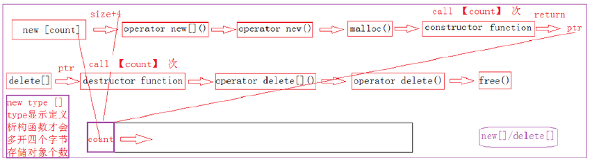
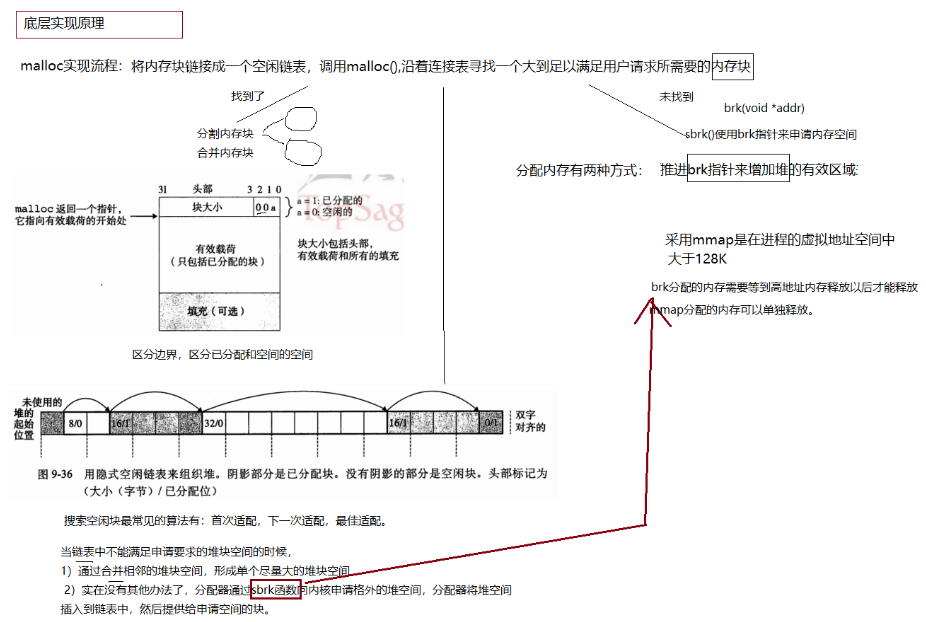
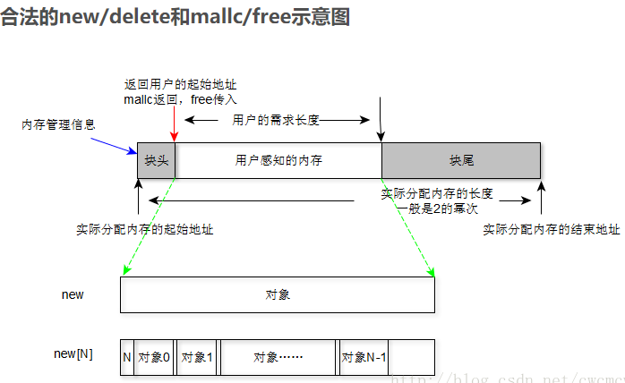
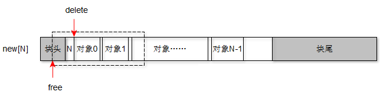

# 6.new/malloc/delete/free

### 1、new和malloc有什么区别？

```c++
int* p1 = (int*)malloc(sizeof(int));//<stdlib.h>头文件中
```

上述代码需要手动的计算开辟空间的大小，malloc的返回类型是void \*，必须强制转换侧想要转换类型的指针。开辟内存失败时返回空，所以在使用的时候需要进行判断结果是否为NULL。

```c++
int*p2 = new int[4];
```

new是编译器自己计算的。new自动返回对应类型指针，其分配内存失败时会抛出bac\_alloc的异常。

**malloc/free为函数只是开辟空间并释放，new/delete则不仅会开辟空间，并调用构造函数和析构函数进行初始化和清理**，如下为new/delete、new\[]/delete\[]实现机制：（new/delete底层是基于malloc/free来实现的）


new\[]/delete\[]则是



在开辟大小会多开辟四个字节，用于存放对象的个数，在返回地址时则会向后偏移4个字节，而在delete时则会查看内存上对象个数，从而根据个数count确定调用几次析构函数，从而完全清理所有对象占用内存。

对于内置类型若new\[]但用delete释放时，没有影响，但若是自定义类型如类时，若释放使用delete时，这时则会只调用一次析构函数，只析构了一个对象，剩下的对象都没有被清理。

**new/delete可以进行重载，malloc/free不可以**。对于malloc分配内存后，若在使用过程中内存分配不够或太多，这时可以使用realloc函数对其进行扩充或缩小，但是new分配好的内存不能这样被直观简单的改变。

对于new/delete与malloc/free申请内存位置说明，malloc我们知道它是在堆上分配内存的，但new其实不能说是在堆上，C++中，对new申请内存位置有一个抽象概念，它为自由存储区，它可以在堆上，也可以在静态存储区上分配，这主要取决于operator new实现细节，取决与它在哪里为对象分配空间。

malloc()从堆里面获得空间，函数返回的指针是指向堆里面的一块内存。free释放的是指针指向的内存，不是指针。指针是一个变量，只有程序结束时才被销毁。释放了内存空间后，原来指向这块空间的指针还是存在。




new和malloc有什么区别？

1.  属性：new/delete是C++关键字，需要编译器支持。malloc/free是库函数，需要头文件支持。
2.  参数：使用new操作符申请内存分配时无须指定内存块的大小，编译器会根据类型信息自行计算。而malloc则需要显式地指出所需内存的尺寸。
3.  返回类型：new操作符内存分配成功时，返回的是对象类型的指针，类型严格与对象匹配，无须进行类型转换，故new是符合类型安全性的操作符。而malloc内存分配成功则是返回void *，需要通过强制类型转换将void*指针转换成我们需要的类型。
4.  分配失败：new内存分配失败时，会抛出bad\_alloc异常。malloc分配内存失败时返回NULL。
5.  自定义类型：new会先调用operator new函数，申请足够的内存（通常底层使用malloc实现）。然后调用类型的构造函数，初始化成员变量，最后返回自定义类型指针。delete先调用析构函数，然后调用operator delete函数释放内存（通常底层使用free实现）。malloc/free是库函数，只能动态的申请和释放内存，无法强制要求其做自定义类型对象构造和析构工作。
6.  重载：C++允许重载new/delete操作符，特别的，布局new的就不需要为对象分配内存，而是指定了一个地址作为内存起始区域，new在这段内存上为对象调用构造函数完成初始化工作，并返回此地址。而malloc不允许重载。
7.  内存区域：new操作符从自由存储区（free store）上为对象动态分配内存空间，而malloc函数从堆上动态分配内存。自由存储区是C++基于new操作符的一个抽象概念，凡是通过new操作符进行内存申请，该内存即为自由存储区。而堆是操作系统中的术语，是操作系统所维护的一块特殊内存，用于程序的内存动态分配，C语言使用malloc从堆上分配内存，使用free释放已分配的对应内存。自由存储区不等于堆，如上所述，布局new就可以不位于堆中。

### 2、.malloc的内存可以用delete释放吗？

不能。

malloc/free主要为了兼容C，new和delete完全可以取代malloc/free的。

malloc/free的操作对象都是必须明确大小的，而且不能用在动态类上。

new和delete会自动进行类型检查和大小，malloc/free不能执行构造函数与析构函数，所以动态对象它是不行的。

当然从理论上说使用malloc申请的内存是可以通过delete释放的。不过一般不这样写的。而且也不能保证每个C++的运行时都能正常。

```c++
int* a = (int*)malloc(sizeof(int));
delete a;
if(a != NULL)
{
    cout<<"lllll"<<endl;  //依旧打印lllll
}
```

### 3、malloc出来20字节内存，为什么free不需要传入20呢，不会产生内存泄漏吗？

不会，malloc在分配内存时会将内存分配大小记录在头部，free析构的时候先解析在析构即可。

### 4、new\[]和delete\[]一定要配对使用吗？为什么？




malloc和free的实际大小，这个信息存储在内存块的块头里面。其中最重要的就是指示实际分配的内存大小（单位：字节），那么在free时，就要将用户的传入的地址，减去块头长度找到实际分配内存的起始地址然后释放掉。块头的长度是8字节。

### 5、new为什么使用delete\[]失败？

new时不会偏移4字节，delete\[]时，编译器就是通过标识符\[]而执行减4字节操作。从上图可知，减后的地址值会落到块头中，同时编译器从块头中提取4字节中的值作为自己执行析构对象的个数，而这4个字节是实际内存的长度，这是一个比较偏大的值，比如256，然后编译器对随后的内存对象执行析构，基本上都会导致内存越界，这必然失败。

### 6、new\[]为什么内嵌类型使用delete成功，自定义类型delete失败？

new\[]，如果是内嵌类型，比如char或者int等等，就是C数组，那么它不会向后（地址变大的方向）偏移4个字节。因此执行delete时，显然不会出现任何问题。

但是如果是自定义类型呢？那么new\[]时就会向后偏移4个字节，从malloc的返回地址偏移4个字节用来存储对象个数，如果使用delete，编译器是识别不出释放的是数组，那么它会直接将传入对象的首地址值处执行一次对象析构，这个时候还不会出现问题，但是再进一步，它把对象的首地址值传递给free时，那么这个地址值并不是malloc返回的地址，而是相差了4个字节，此时free向前偏移取出malloc的实际长度时，就会取出对象的个数值作为实际的分配长度进行释放，显然这将导致只释放了n字节，其余的块头一部分和除n字节的所有内存都泄露了，并且只有第一个对象成功析构，其余都没有析构操作。一般对象个数n是个非常小的值，比如128个对象，那么free只释放了128字节。（注意：不同的libc实现不同，这里只示例阐述原理，不深究数字）


