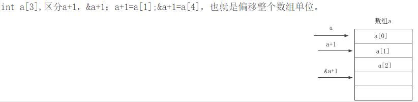

# 7.类的大小

复习以下字节对齐规则：

1.  每个成员的偏移量都必须是当前成员所占内存大小的整数倍，如果不是编译器会在成员之间加上填充字节。
2.  当所有成员大小计算完毕后，编译器判断当前结构体大小是否是结构体中最宽的成员变量大小的整数倍，如果不是会在最后一个成员后做字节填充。

关于类、对象大小的计算

1.  类的大小的计算遵循结构体的对齐原则
2.  类的大小与普通数据成员变量有关，与成员函数和静态成员无关。即普通成员函数、静态成员函数、静态数据成员、静态常量数据成员均对类的大小无影响。
3.  虚函数对类的大小有影响，是因为虚函数表指针的存在。
4.  虚继承对类的大小有影响，是因为虚基表指针带来的影响。
5.  空类的大小是一个特殊情况，空类的大小为1。

解释说明：

-   静态数据成员之所以不计算在类的对象大小内，是因为类的静态数据成员被该类所有的对象所共享，并不是具体哪一个对象，静态数据成员定义在内存的全局区。
-   空类的大小、以及含有虚函数、虚继承、多继承是特殊情况需要注意讨论。

> 注：MSVC 32位指针大小为4，64位为8

### 1、简单计算

```c++
class base
{
public:
    base()=default;//普通函数无影响
    ~base()=default;
    int add(int a, int b)
    {
        return a + b;
    }
private:
    static int a;//静态变量无影响
    int b;
    char c;
};

int main()
{
    base a;
    cout<<"a:::"<<sizeof(a)<<endl;//a:::8
}
```

静态变量a不计算在对象的大小内，由于字节对齐，结果为4+4=8

### 2、空类的大小

这里的C++空类是指这个类不带任何数据，即类中没有非静态(non-static)数据成员变量，没有虚函数(virtual function)，也没有虚基类(virtual base class)。

直观地看，空类对象不使用任何空间，因为没有任何隶属对象的数据需要存储。然而，C++标准规定，凡是一个独立的(非附属)对象都必须具有非零大小。换句话说，**c++空类的大小不为0，为1**

```c++
class base2{};
int main()
{
    base2 a;
    cout<<"a:::"<<sizeof(a)<<endl;//a:::1
}
```

C++标准指出，不允许一个对象（当然包括类对象）的大小为0，不同的对象不能具有相同的地址。这是由于：

-   new需要分配不同的内存地址，不能分配内存大小为0的空间
-   避免除以sizeof(T)时得到除以0错误，故**使用一个字节来区分空类**。

但是有特殊情况

（1）空类继承，即派生类继承了空类，如果派生类有自己的数据成员，基类的一个字节大小就不会加到派生类中去。

```c++
class base2{};
class base3:public base2{};
class base4:public base2{
public:
    base4(){};
    int a;
    static char b;
    char c;
};
int main()
{
    base3 a;
    cout<<"a:::"<<sizeof(a)<<endl;//a:::1
    base4 b;
    cout<<"b:::"<<sizeof(b)<<endl;//b:::8,内存对齐了
}
```

（2）一个类包含了一个空类的对象。

```c++
class base4{
public:
    base4(){};
    base3 b3;
    int a;
    static char b;
    char c;
};
int main()
{
    base4 b;
    /* 偏移量  字节大小
       * 0        1
       * 1->4     4
       * 4 + 4    1
       * 9 内存对齐 9 + 3 = 12
      */
    cout<<"b:::"<<sizeof(b)<<endl;//b:::12
}
```

这个空类1字节是会被计算进去的，在会字节对齐。

### 3、含虚函数成员

```c++
class testVirtual
{
public:
    testVirtual(){};
    ~testVirtual(){};

    virtual void virtual1(){};
    virtual void virtual2(){};
    virtual void virtual3(){};
    virtual void virtual4(){};
};

int main()
{
    testVirtual test;
    cout<<"test sizeof :: "<<sizeof(test)<<endl;//4,虚函数表指针的长度
}
```

虚函数（Virtual Function）是通过一张虚函数表（Virtual Table）来实现的。编译器必需要保证虚函数表的指针存在于对象实例中最前面的位置（这是为了保证正确取到虚函数的偏移量）。

每当创建一个包含有虚函数的类或从包含有虚函数的类派生一个类时，编译器就会为这个类创建一个虚函数表（VTABLE）保存该类所有虚函数的地址，其实这个VTABLE的作用就是保存自己类中所有虚函数的地址，可以把VTABLE形象地看成一个函数指针数组，这个数组的每个元素存放的就是虚函数的地址。在每个带有虚函数的类中，编译器秘密地置入一指针，称为vpointer（缩写为VPTR），指向这个对象的VTABLE。当构造该派生类对象时，其成员VPTR被初始化指向该派生类的VTABLE。所以可以认为VTABLE是该类的所有对象共有的，在定义该类时被初始化；而VPTR则是每个类对象都有独立一份的，且在该类对象被构造时被初始化。

虚函数表的最后多加了一个结点，这是虚函数表的结束结点，就像字符串的结束符"\0"一样，其标志了虚函数表的结束。这个结束标志的值在不同的编译器下是不同的。在vs下，这个值是NULL。而在linux下，这个值是如果1，表示还有下一个虚函数表，如果值是0，表示是最后一个虚函数表。

```c++
class testVirtual
{
public:
    testVirtual(){};
    ~testVirtual(){};

    char i;
    virtual void virtual1(){};
    virtual void virtual2(){};
    virtual void virtual3(){};
    virtual void virtual4(){};
};

int main()
{
    testVirtual test;
    cout<<"test sizeof :: "<<sizeof(test)<<endl;//8,内存对齐
}
```

### 4、单继承

```c++
class testVirtual
{
public:
    testVirtual(){};
    ~testVirtual(){};

    char i;
    virtual void virtual1(){};
    virtual void virtual2(){};
    virtual void virtual3(){};
    virtual void virtual4(){};
};
class conterteVirtual:public testVirtual
{
public:
    conterteVirtual(){};
    ~conterteVirtual(){};

    int a;
    virtual void virtual1(){};
    void virtual5(){};
    void virtual6(){};
    void virtual7(){};
};
int main()
{
    conterteVirtual test;
    cout<<"test sizeof :: "<<sizeof(test)<<endl;//12, i+a+vptr
}
```

不管有没有函数的覆盖，继承的结果是一样的，其大小为基类和派生类的非静态函数成员的大小+一个vptr指针的大小。

### 5、多继承

```c++
class testVirtual
{
public:
    testVirtual(){};
    ~testVirtual(){};

    char i;
    virtual void virtual1(){};
    virtual void virtual2(){};
    virtual void virtual3(){};
    virtual void virtual4(){};
};
class testVirtual1
{
public:
    testVirtual1(){};
    ~testVirtual1(){};

    char i;
    virtual void virtual11(){};
    virtual void virtual21(){};
    virtual void virtual31(){};
    virtual void virtual41(){};
};
class conterteVirtual:public testVirtual, public testVirtual1{
public:
    conterteVirtual(){};
    ~conterteVirtual(){};

    int a;
    void virtual5(){};
    void virtual6(){};
    void virtual7(){};
};
int main()
{
    conterteVirtual test;
    cout<<"test sizeof :: "<<sizeof(test)<<endl;//8+8+4 = 20；
}
```

不管有无虚函数的覆盖，结果都是所有类的所有非静态数据成员的大小+所有虚指针的大小。

### 6、虚继承的情况

```c++
class A {

    int a;

};
class B:virtual public A{

    virtual void myfunB(){}

};
class C:virtual public A{

    virtual void myfunC(){}

};
class D:public B,public C{

    virtual void myfunD(){}

};
int main()
{

    cout<<"test sizeof A :: "<<sizeof(A)<<endl;//4；
    cout<<"test sizeof B :: "<<sizeof(B)<<endl;//12,B C为虚继承,因此大小为int大小加指向虚基类的指针的大小
    cout<<"test sizeof C :: "<<sizeof(C)<<endl;//12
    cout<<"test sizeof D :: "<<sizeof(D)<<endl;//20
}
```

A的大小为int大小加上虚表指针大小。B，C中由于是虚继承因此大小为int大小加指向虚基类的指针的大小。B,C虽然加入了自己的虚函数，但是虚表指针是和基类共享的，因此不会有自己的虚表指针，他们两个共用虚基类A的虚表指针。D由于B,C都是虚继承，因此D只包含一个A的副本，于是D大小就等于int变量的大小+B中的指向虚基类的指针+C中的指向虚基类的指针+一个虚表指针的大小,由于字节对齐，结果为8+8+4。

总结：

类对象的大小=各非静态数据成员（包括父类的非静态数据成员但都不包括所有的成员函数）的总和+vfptr指针(多继承下可能不止一个)+vbptr指针(多继承下可能不止一个)+编译器额外增加的字节。

腾讯面试题，下面代码在64位计算机上运行结果

```c++
#include <stdio.h>
#include <string.h>
struct st_t {
    int status;
    short *pdata; //64位系统下指针占8个字节。 
    char errstr[32]; //需要考虑数据对齐 
};

int main(){
    st_t st[16],a;
    char *p=(char *)(st[2].errstr+32);
    //printf("%d\r\n",sizeof(a));
    printf("%d",(p-(char *)(st)));//他们之间所隔元素占用的内存大小 144
    /*解析
     * st[16]的大小16*48
     * p的大小是2*48+8+8+32 = 144
     * st是首地址
     * p-(char *)(st) = 144；
    */
    return  0;
}
```


