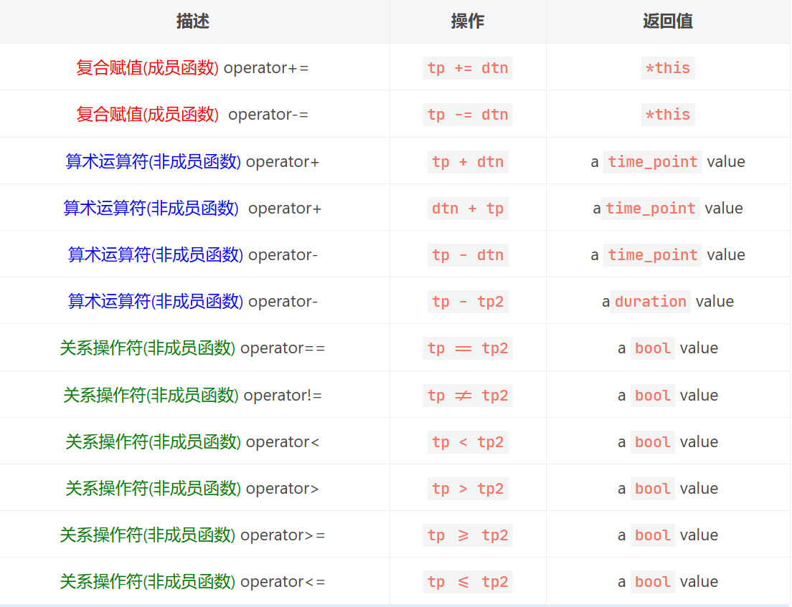

# 1.处理日期和时间的chrono库

C++11中提供了日期和时间相关的库chrono，通过chrono库可以很方便地处理日期和时间，为程序的开发提供了便利。chrono库主要包含三种类型的类：`时间间隔duration`、`时钟clocks`、`时间点time point`。

# 1.时间间隔duration

## 1.1 常用类成员

\*\*`duration`\*\***表示一段时间间隔**，用来记录时间长度，可以表示几秒、几分钟、几个小时的时间间隔。duration的原型如下：

```c++
// 定义于头文件 <chrono>
template<
    class Rep,
    class Period = std::ratio<1>
> class duration;
```

-   `Rep`：这是一个数值类型，表示时钟数（周期）的类型（默认为整形）。若 `Rep `是浮点数，则 `duration `能使用小数描述时钟周期的数目。
-   `Period`：表示时钟的周期，它的原型如下：

```c++
// 定义于头文件 <ratio>
template<
    std::intmax_t Num,
    std::intmax_t Denom = 1
> class ratio;
```

`ratio`类表示每个时钟周期的秒数，其中第一个模板参数Num代表分子，Denom代表分母，该分母值默认为1，因此，**ratio代表的是一个分子除以分母的数值**，比如：ratio<2>代表一个时钟周期是2秒，ratio<60>代表一分钟，ratio<60\*60\*>\*代表一个小时，ratio<60\*60\*24>代表一天。而ratio<1,1000>代表的是1/1000秒，也就是1毫秒，ratio<1,1000000>代表一微秒，ratio<1,1000000000>代表一纳秒。

为了方便使用，在标准库中定义了一些常用的时间间隔，比如：时、分、秒、毫秒、微秒、纳秒，它们都位于chrono命名空间下，定义如下：

| **类型**                         | **定义**                                                     |
| ------------------------------ | ---------------------------------------------------------- |
| 纳秒：`std::chrono::nanoseconds`  | `duration<Rep*/`*`至少 64 位的有符号整数类型`*`/*, std::nano>`        |
| 微秒：`std::chrono::microseconds` | `duration<Rep*/`*`至少 55 位的有符号整数类型`*`/*, std::micro>`       |
| 毫秒：`std::chrono::milliseconds` | `duration<Rep*/`*`至少 45 位的有符号整数类型`*`/*, std::milli>`       |
| 秒： `std::chrono::seconds`      | `duration<Rep*/`*`至少 35 位的有符号整数类型`*`/*>`                   |
| 分钟：`std::chrono::minutes`      | `duration<Rep*/`*`至少 29 位的有符号整数类型`*`/*, std::ratio<60>>`   |
| 小时：`std::chrono::hours`        | `duration<Rep*/`*`至少 23 位的有符号整数类型`*`/*, std::ratio<3600>>` |

注意：到 `hours `为止的每个预定义时长类型至少涵盖 ±292 年的范围。

duration类的构造函数原型如下：

```c++
// 1. 拷贝构造函数
duration( const duration& ) = default;
// 2. 通过指定时钟周期的类型来构造对象
template< class Rep2 >
constexpr explicit duration( const Rep2& r );
// 3. 通过指定时钟周期类型，和时钟周期长度来构造对象
template< class Rep2, class Period2 >
constexpr duration( const duration<Rep2,Period2>& d );

```

为了更加方便的进行duration对象之间的操作，类内部进行了操作符重载：

| **操作符重载**                                                                | **描述**                |
| ------------------------------------------------------------------------ | --------------------- |
| operator=                                                                | 赋值内容 (公开成员函数)         |
| operator+&#xA;operator-                                                  | 实现一元 + 和一元 - (公开成员函数) |
| operator++&#xA;operator++(int)&#xA;operator–&#xA;operator–(int)          | 递增或递减周期计数 (公开成员函数)    |
| operator+=&#xA;operator-=&#xA;operator \*=&#xA;operator/=&#xA;operator%= | 实现二个时长间的复合赋值 (公开成员函数) |

duration类还提供了**获取时间间隔的时钟周期数**的方法`count()`，函数原型如下：

```c++
constexpr rep count() const;
```

## 1.2 类的使用

通过构造函数构造事件间隔对象示例代码如下：

```c++
#include <chrono>
#include <iostream>
using namespace std;
int main()
{
    chrono::hours h(1);                          // 一小时
    chrono::milliseconds ms{ 3 };                // 3 毫秒
    chrono::duration<int, ratio<1000>> ks(3);    // 3000 秒

    // chrono::duration<int, ratio<1000>> d3(3.5);  // error
    chrono::duration<double> dd(6.6);               // 6.6 秒

    // 使用小数表示时钟周期的次数
    chrono::duration<double, std::ratio<1, 30>> hz(3.5);
}

```

-   `h(1)`时钟周期为1小时，共有1个时钟周期，所以h表示的时间间隔为1小时
-   `ms(3)`时钟周期为1毫秒，共有3个时钟周期，所以ms表示的时间间隔为3毫秒
-   `ks(3)`时钟周期为1000秒，一共有三个时钟周期，所以ks表示的时间间隔为3000秒
-   `d3(3.5)`时钟周期为1000秒，时钟周期数量只能用整形来表示，但是此处指定的是浮点数，因此语法错误
-   `dd(6.6)`**时钟周期为默认的1秒**，共有6.6个时钟周期，所以dd表示的时间间隔为6.6秒
-   `hz(3.5)`**时钟周期为1/30秒**，共有3.5个时钟周期，所以hz表示的时间间隔为1/30\*3.5秒

chrono库中根据duration类封装了不同长度的时钟周期（也可以自定义），基于这个时钟周期再进行周期次数的设置就可以得到总的时间间隔了（`时钟周期 * 周期次数 = 总的时间间隔`）。

示例代码：

```c++
#include <chrono>
#include <iostream>
int main()
{
    std::chrono::milliseconds ms{3};         // 3 毫秒
    std::chrono::microseconds us = 2*ms;     // 6000 微秒
    // 时间间隔周期为 1/30 秒
    std::chrono::duration<double, std::ratio<1, 30>> hz(3.5);
 
    std::cout <<  "3 ms duration has " << ms.count() << " ticks\n"
              <<  "6000 us duration has " << us.count() << " ticks\n"
              <<  "3.5 hz duration has " << hz.count() << " ticks\n";       
}
```

输出结果为：

```bash
3 ms duration has 3 ticks
6000 us duration has 6000 ticks
3.5 hz duration has 3.5 ticks
```

-   `ms`时间单位为毫秒，初始化操作`ms{3}`表示时间间隔为`3`毫秒，一共有3个时间周期，每个周期为1毫秒
-   `us`时间单位为微秒，初始化操作`2*ms`表示时间间隔为6000微秒，一共有6000个时间周期，每个周期为1微秒
-   `hz`时间单位为秒，初始化操作`hz(3.5)`表示时间间隔为`1/30*3.5`秒，一共有3.5个时间周期，每个周期为1/30秒

由于在duration类内部做了操作符重载，因此时间间隔之间可以直接进行算术运算，比如我们要计算两个时间间隔的差值，就可以在代码中做如下处理：

```c++
#include <iostream>
#include <chrono>
using namespace std;

int main()
{
    chrono::minutes t1(10);
    chrono::seconds t2(60);
    chrono::seconds t3 = t1 - t2;
    cout << t3.count() << " second" << endl;
}

```

程序输出的结果

```bash
540 second
```

在上面的测试程序中，t1代表10分钟，t2代表60秒，t3是t1减去t2，也就是60\*10-60=540，这个540表示的时钟周期，每个时钟周期是1秒，因此两个时间间隔之间的差值为540秒。

**注意事项**：duration的加减运算有一定的规则，当两个duration时钟周期不相同的时候，会先统一成一种时钟，然后再进行算术运算，统一的规则如下：假设有`ratio<x1,y1>` 和 `ratio<x2,y2>`两个时钟周期，首先需要求出x1，x2的**最大公约数X**，然后求出y1，y2的**最小公倍数Y**，统一之后的时钟周期ratio为`ratio<X,Y>`。

```c++
#include <iostream>
#include <chrono>
using namespace std;

int main()
{
    chrono::duration<double, ratio<9, 7>> d1(3);
    chrono::duration<double, ratio<6, 5>> d2(1);
    // d1 和 d2 统一之后的时钟周期
    chrono::duration<double, ratio<3, 35>> d3 = d1 - d2;
}

```

对于分子6,、9最大公约数为3，对于分母7、5最小公倍数为35，因此推导出的时钟周期为`ratio<3,35>`

# 2.时间点 time point

chrono库中提供了一个表示时间点的类`time_point`，该类的定义如下：

```c++
// 定义于头文件 <chrono>
template<
    class Clock,
    class Duration = typename Clock::duration
> class time_point;

```

它被实现成如同存储一个 `Duration `类型的自 `Clock `的纪元起始开始的时间间隔的值，通过这个类最终可以得到时间中的某一个时间点。

-   `Clock`：此时间点在此时钟上计量
-   `Duration`：用于计量从纪元起时间的 `std::chrono::duration` 类型

`time_point`类的构造函数原型如下：

```c++
// 1. 构造一个以新纪元(epoch，即：1970.1.1)作为值的对象，需要和时钟类一起使用，不能单独使用该无参构造函数
time_point();
// 2. 构造一个对象，表示一个时间点，其中d的持续时间从epoch开始，需要和时钟类一起使用，不能单独使用该构造函数
explicit time_point( const duration& d );
// 3. 拷贝构造函数，构造与t相同时间点的对象，使用的时候需要指定模板参数
template< class Duration2 >
time_point( const time_point<Clock,Duration2>& t );

```

在这个类中除了构造函数还提供了另外一个`time_since_epoch()`函数，用来获得1970年1月1日到time\_point对象中记录的时间经过的时间间隔（duration），函数原型如下：

```c++
duration time_since_epoch() const;
```

除此之外，时间点`time_point`对象和时间段对象`duration`之间还支持直接进行算术运算（即加减运算），时间点对象之间可以进行逻辑运算，具体细节可以参考下面的表格：

其中 `tp `和 `tp2 `是`time_point `类型的对象， `dtn `是`duration`类型的对象。



由于该时间点类经常和下面要介绍的时钟类一起使用，所以在此先不举例，在时钟类的示例代码中会涉及到时间点类的使用，到此为止只需要搞明白时间点类的提供的这几个函数的作用就可以了。

# 3.时钟clocks

chrono库中提供了获取当前的系统时间的时钟类，包含的时钟一共有三种：

-   `system_clock`：系统的时钟，系统的时钟可以修改，甚至可以网络对时，因此使用系统时间计算时间差可能不准。
-   `steady_clock`：是固定的时钟，相当于秒表。开始计时后，时间只会增长并且不能修改，适合用于记录程序耗时
-   `high_resolution_clock`：和时钟类 `steady_clock `是等价的（是它的别名）。

在这些时钟类的内部有`time_point`、`duration`、`Rep`、`Period`等信息，基于这些信息来获取当前时间，以及实现`time_t`和`time_point`之间的相互转换。

| **时钟类成员类型**  | **描述**                    |
| ------------ | ------------------------- |
| `rep`        | 表示时钟周期次数的有符号算术类型          |
| `period`     | 表示时钟计次周期的 `std::ratio` 类型 |
| `duration`   | 时间间隔，可以表示负时长              |
| `time_point` | 表示在当前时钟里边记录的时间点           |

**在使用chrono提供的时钟类的时候，不需要创建类对象，直接调用类的静态方法就可以得到想要的时间了**。

## 3.1 system\_clock

具体来说，时钟类`system_clock`是一个系统范围的实时时钟。`system_clock`提供了对当前时间点`time_point`的访问，将得到时间点转换为`time_t`类型的时间对象，就可以基于这个时间对象获取到当前的时间信息了。

`system_clock`时钟类在底层源码中的定义如下：

```c++
struct system_clock { // wraps GetSystemTimePreciseAsFileTime/GetSystemTimeAsFileTime
    using rep                       = long long;
    using period                    = ratio<1, 10'000'000>; // 100 nanoseconds
    using duration                  = chrono::duration<rep, period>;
    using time_point                = chrono::time_point<system_clock>;
    static constexpr bool is_steady = false;

    _NODISCARD static time_point now() noexcept 
    { // get current time
        return time_point(duration(_Xtime_get_ticks()));
    }

    _NODISCARD static __time64_t to_time_t(const time_point& _Time) noexcept 
    { // convert to __time64_t
        return duration_cast<seconds>(_Time.time_since_epoch()).count();
    }

    _NODISCARD static time_point from_time_t(__time64_t _Tm) noexcept 
    { // convert from __time64_t
        return time_point{seconds{_Tm}};
    }
};

```

通过以上源码可以了解到在system\_clock类中的一些细节信息：

-   `rep`：时钟周期次数是通过整形来记录的`long long`
-   `period`：一个时钟周期是100纳秒`ratio<1, 10'000'000>`
-   `duration`：时间间隔为rep\*period纳秒`chrono::duration<rep, period>`
-   `time_point`：时间点通过系统时钟做了初始化`chrono::time_point<system_clock>`，里面记录了新纪元时间点

另外还可以看到`system_clock`类一共提供了三个静态成员函数：

```c++
// 返回表示当前时间的时间点。
static std::chrono::time_point<std::chrono::system_clock> now() noexcept;
// 将 time_point 时间点类型转换为 std::time_t 类型
static std::time_t to_time_t( const time_point& t ) noexcept;
// 将 std::time_t 类型转换为 time_point 时间点类型
static std::chrono::system_clock::time_point from_time_t( std::time_t t ) noexcept;

```

比如，我们要获取当前的系统时间，并且需要将其以能够识别的方式打印出来，示例代码如下：

```c++
#include <chrono>
#include <iostream>
using namespace std;
using namespace std::chrono;
int main()
{
    // 新纪元1970.1.1时间
    system_clock::time_point epoch;

    duration<int, ratio<60*60*24>> day(1);
    // 新纪元1970.1.1时间 + 1天
    system_clock::time_point ppt(day);

    using dday = duration<int, ratio<60 * 60 * 24>>;
    // 新纪元1970.1.1时间 + 10天
    time_point<system_clock, dday> t(dday(10));

    // 系统当前时间
    system_clock::time_point today = system_clock::now();
    
    // 转换为time_t时间类型
    time_t tm = system_clock::to_time_t(today);
    cout << "今天的日期是:    " << ctime(&tm);

    time_t tm1 = system_clock::to_time_t(today+day);
    cout << "明天的日期是:    " << ctime(&tm1);

    time_t tm2 = system_clock::to_time_t(epoch);
    cout << "新纪元时间:      " << ctime(&tm2);

    time_t tm3 = system_clock::to_time_t(ppt);
    cout << "新纪元时间+1天:  " << ctime(&tm3);

    time_t tm4 = system_clock::to_time_t(t);
    cout << "新纪元时间+10天: " << ctime(&tm4);
}

```

示例代码打印的结果为：

```bash
今天的日期是:    Wed Sep  6 14:48:55 2023
明天的日期是:    Thu Sep  7 14:48:55 2023
新纪元时间:      Thu Jan  1 08:00:00 1970
新纪元时间+1天:  Fri Jan  2 08:00:00 1970
新纪元时间+10天: Sun Jan 11 08:00:00 1970
```

## 3.2 steady\_clock

如果我们通过时钟不是为了获取当前的系统时间，而是进行程序耗时的时长，此时使用`syetem_clock`就不合适了，因为这个时间可以跟随系统的设置发生变化。在C++11中提供的时钟类`steady_clock`相当于秒表，只要启动就会进行时间的累加，并且不能被修改，非常适合于进行耗时的统计。

`steady_clock`时钟类在底层源码中的定义如下：

```c++
struct steady_clock { // wraps QueryPerformanceCounter
    using rep                       = long long;
    using period                    = nano;
    using duration                  = nanoseconds;
    using time_point                = chrono::time_point<steady_clock>;
    static constexpr bool is_steady = true;

    // get current time
    _NODISCARD static time_point now() noexcept 
    { 
        // doesn't change after system boot
        const long long _Freq = _Query_perf_frequency(); 
        const long long _Ctr  = _Query_perf_counter();
        static_assert(period::num == 1, "This assumes period::num == 1.");
        const long long _Whole = (_Ctr / _Freq) * period::den;
        const long long _Part  = (_Ctr % _Freq) * period::den / _Freq;
        return time_point(duration(_Whole + _Part));
    }
};

```

通过以上源码可以了解到在steady\_clock类中的一些细节信息：

-   `rep`：时钟周期次数是通过整形来记录的`long long`
-   `period`：一个时钟周期是1纳秒nano
-   `duration`：时间间隔为1纳秒nanoseconds
-   `time_point`：时间点通过系统时钟做了初始化`chrono::time_point<system_clock>`，里面记录了新纪元时间点

另外，在这个类中也提供了一个静态的now()方法，用于得到当前的时间点，函数原型如下：

```c++
static std::chrono::time_point<std::chrono::steady_clock> now() noexcept;
```

假设要测试某一段程序的执行效率，可以计算它执行期间消耗的总时长，示例代码如下：

```c++
#include <chrono>
#include <iostream>
using namespace std;
using namespace std::chrono;
int main()
{
    // 获取开始时间点
    steady_clock::time_point start = steady_clock::now();
    // 执行业务流程
    cout << "print 1000 stars ...." << endl;
    for (int i = 0; i < 1000; ++i)
    {
        cout << "*";
    }
    cout << endl;
    // 获取结束时间点
    steady_clock::time_point last = steady_clock::now();
    // 计算差值
    auto dt = last - start;
    cout << "总共耗时: " << dt.count() << "纳秒" << endl;
}

```

## 3.3 high\_resolution\_clock

`high_resolution_clock`提供的时钟精度比`system_clock`要高，它也是不可以修改的。在底层源码中，这个类其实是`steady_clock`类的别名。

```c++
using high_resolution_clock = steady_clock;
```

因此`high_resolution_clock`的使用方式和`steady_clock`是一样的，在此就不再过多进行赘述了。

# 4.转换函数

## 4.1 duration\_cast

`duration_cast`是`chrono`库提供的一个模板函数，这个函数不属于`duration`类。通过这个函数可以对`duration`类对象内部的时钟周期`Period`，和周期次数的类型`Rep`进行修改，该函数原型如下：

```c++
template <class ToDuration, class Rep, class Period>
  constexpr ToDuration duration_cast (const duration<Rep,Period>& dtn);

```

1.  如果是对时钟周期进行转换：源时钟周期必须能够整除目的时钟周期（比如：小时到分钟）。
2.  如果是对时钟周期次数的类型进行转换：低等类型默认可以向高等类型进行转换（比如：int 转 double）。
3.  如果时钟周期和时钟周期次数类型都变了，根据第二点进行推导（也就是看时间周期次数类型）。
4.  以上条件都不满足，那么就需要使用 duration\_cast 进行显示转换。

我们可以修改一下上面测试程序执行时间的代码，在代码中修改duration对象的属性：

```c++
#include <iostream>
#include <chrono>
using namespace std;
using namespace std::chrono;

void f()
{
    cout << "print 1000 stars ...." << endl;
    for (int i = 0; i < 1000; ++i)
    {
        cout << "*";
    }
    cout << endl;
}

int main()
{
    auto t1 = steady_clock::now();
    f();
    auto t2 = steady_clock::now();

    // 整数时长：时钟周期纳秒转毫秒，要求 duration_cast
    auto int_ms = duration_cast<chrono::milliseconds>(t2 - t1);

    // 小数时长：不要求 duration_cast
    duration<double, ratio<1, 1000>> fp_ms = t2 - t1;

    cout << "f() took " << fp_ms.count() << " ms, "
        << "or " << int_ms.count() << " whole milliseconds\n";
}

```

结果输出：

```bash
print 1000 stars ....
****************************************************************************************************************************************************************************************************************************************************************************************************************************************************************************************************************************************************************************************************************************************************************************************************************************************************************************************************************************************************************************************************************************************************************************************************************************************************************************************************************************************
f() took 40.2547 ms, or 40 whole milliseconds

```

## 4.2 time\_point\_cast

`time_point_cast`也是`chrono`库提供的一个模板函数，这个函数不属于`time_point`类。函数的作用是对时间点进行转换，因为不同的时间点对象内部的时钟周期`Period`，和周期次数的类型`Rep`可能也是不同的，一般情况下它们之间可以进行隐式类型转换，也可以通过该函数显示的进行转换，函数原型如下：

```c++
template <class ToDuration, class Clock, class Duration>
time_point<Clock, ToDuration> time_point_cast(const time_point<Clock, Duration> &t);

```

关于函数的使用，示例代码如下：

```c++
#include <chrono>
#include <iostream>
using namespace std;

using Clock = chrono::high_resolution_clock;
using Ms = chrono::milliseconds;
using Sec = chrono::seconds;
template<class Duration>
using TimePoint = chrono::time_point<Clock, Duration>;

void print_ms(const TimePoint<Ms>& time_point)
{
    std::cout << time_point.time_since_epoch().count() << " ms\n";
}

int main()
{
    TimePoint<Sec> time_point_sec(Sec(6));
    // 无精度损失, 可以进行隐式类型转换
    TimePoint<Ms> time_point_ms(time_point_sec);
    print_ms(time_point_ms);    // 6000 ms

    time_point_ms = TimePoint<Ms>(Ms(6789));
    // error，会损失精度，不允许进行隐式的类型转换
    TimePoint<Sec> sec(time_point_ms);

    // 显示类型转换,会损失精度。6789 truncated to 6000
    time_point_sec = std::chrono::time_point_cast<Sec>(time_point_ms);
    print_ms(time_point_sec); // 6000 ms
}

```

注意事项：关于时间点的转换如果没有没有精度的损失可以直接进行隐式类型转换，如果会损失精度只能通过显示类型转换，也就是调用time\_point\_cast函数来完成该操作。
