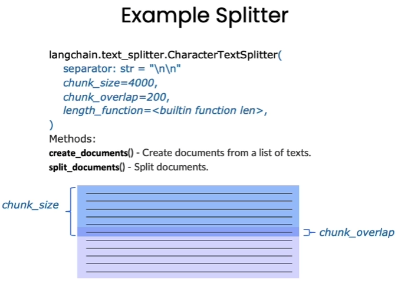

# 4.数据库搭建

## 1.知识库文档处理

### 1.1 知识库设计

知识库文档选用`pdf`、`md`等文件

### 1.2 文档加载

#### （1）PDF文档

使用 `PyMuPDFLoader `来读取知识库的 PDF 文件。`PyMuPDFLoader `是 PDF 解析器中速度最快的一种，结果会包含 PDF 及其页面的详细元数据，并且每页返回一个文档。

```bash
## 安装必要的库
pip install rapidocr_onnxruntime -i https://pypi.tuna.tsinghua.edu.cn/simple
pip install "unstructured[all-docs]" -i https://pypi.tuna.tsinghua.edu.cn/simple
pip install pyMuPDF -i https://pypi.tuna.tsinghua.edu.cn/simple
```

```python
from langchain.document_loaders import PyMuPDFLoader

# 创建一个 PyMuPDFLoader Class 实例，输入为待加载的 pdf 文档路径
loader = PyMuPDFLoader("database/knowledge_db/cpp_pdf/C++17.pdf")

# 调用 PyMuPDFLoader Class 的函数 load 对 pdf 文件进行加载
pages = loader.load()
```

文档加载后储存在 `pages` 变量中：

-   `page` 的变量类型为 `List`
-   打印 `pages` 的长度可以看到 pdf 一共包含多少页

```python
print(f"载入后的变量类型为：{type(pages)}，",  f"该 PDF 一共包含 {len(pages)} 页")

```

`page` 中的每一元素为一个文档，变量类型为 `langchain.schema.document.Document`, 文档变量类型包含两个属性

-   `page_content` 包含该文档的内容。
-   `meta_data` 为文档相关的描述性数据。

```python
page = pages[1]
print(f"每一个元素的类型：{type(page)}.", 
    f"该文档的描述性数据：{page.metadata}", 
    f"查看该文档的内容:\n{page.page_content[0:1000]}", 
    sep="\n------\n")

```

#### （2）MD文档

以几乎完全一致的方式读入 markdown 文档：

```python
from langchain.document_loaders import UnstructuredMarkdownLoader

loader = UnstructuredMarkdownLoader("database/knowledge_db/cpp_md/C++多线程.md")
pages = loader.load()

```

读取的对象和 `PDF `文档读取出来是完全一致的：

```python
print(f"载入后的变量类型为：{type(pages)}，",  f"该 Markdown 一共包含 {len(pages)} 页")

```

```python
page = pages[0]
print(f"每一个元素的类型：{type(page)}.", 
    f"该文档的描述性数据：{page.metadata}", 
    f"查看该文档的内容:\n{page.page_content[0:]}", 
    sep="\n------\n")

```

#### （3）txt文档

可以以几乎完全一致的方式读入 txt文档：

```python
from langchain.document_loaders import UnstructuredFileLoader
loader = UnstructuredFileLoader("data_base/knowledge_db/cpp_txt/cpp.txt")
pages = loader.load()
```

加载出来的数据属性同上文一致：

```python
page = pages[0]
print(f"每一个元素的类型：{type(page)}.", 
    f"该文档的描述性数据：{page.metadata}", 
    f"查看该文档的内容:\n{page.page_content[0:1000]}", 
    sep="\n------\n")

```

### 1.3 文档分割

Langchain 中文本分割器都根据 `chunk_size` (块大小)和 `chunk_overlap` (块与块之间的重叠大小)进行分割。



-   `chunk_size` 指每个块包含的字符或 Token（如单词、句子等）的数量
-   `chunk_overlap` 指两个块之间共享的字符数量，用于保持上下文的连贯性，避免分割丢失上下文信息

Langchain 提供多种文档分割方式，区别在怎么确定块与块之间的边界、块由哪些字符`/token`组成、以及如何测量块大小

-   `RecursiveCharacterTextSplitter()`: 按字符串分割文本，递归地尝试按不同的分隔符进行分割文本。
-   `CharacterTextSplitter()`: 按字符来分割文本。
-   `MarkdownHeaderTextSplitter()`: 基于指定的标题来分割markdown 文件。
-   `TokenTextSplitter()`: 按token来分割文本。
-   `SentenceTransformersTokenTextSplitter()`: 按token来分割文本。
-   `Language()`: 用于 CPP、Python、Ruby、Markdown 等。
-   `NLTKTextSplitter()`: 使用 NLTK（自然语言工具包）按句子分割文本。
-   `SpacyTextSplitter()`: 使用 Spacy按句子的切割文本。

```python
''' 
* RecursiveCharacterTextSplitter 递归字符文本分割
RecursiveCharacterTextSplitter 将按不同的字符递归地分割(按照这个优先级["\n\n", "\n", " ", ""])，
    这样就能尽量把所有和语义相关的内容尽可能长时间地保留在同一位置
RecursiveCharacterTextSplitter需要关注的是4个参数：

* separators - 分隔符字符串数组
* chunk_size - 每个文档的字符数量限制
* chunk_overlap - 两份文档重叠区域的长度
* length_function - 长度计算函数
'''
#导入文本分割器
from langchain.text_splitter import RecursiveCharacterTextSplitter

```

```python
# 知识库中单段文本长度
CHUNK_SIZE = 500

# 知识库中相邻文本重合长度
OVERLAP_SIZE = 50

```

```python
# 此处我们使用 PDF 文件作为示例
from langchain.document_loaders import PyMuPDFLoader

# 创建一个 PyMuPDFLoader Class 实例，输入为待加载的 pdf 文档路径
loader = PyMuPDFLoader("database/knowledge_db/cpp_pdf/C++17.pdf")

# 调用 PyMuPDFLoader Class 的函数 load 对 pdf 文件进行加载
pages = loader.load()
page = pages[1]

# 使用递归字符文本分割器
from langchain.text_splitter import TokenTextSplitter
text_splitter = RecursiveCharacterTextSplitter(
    chunk_size=CHUNK_SIZE,
    chunk_overlap=OVERLAP_SIZE
)
text_splitter.split_text(page.page_content[0:1000])

```

```python
split_docs = text_splitter.split_documents(pages)
print(f"切分后的文件数量：{len(split_docs)}")


print(f"切分后的字符数（可以用来大致评估 token 数）：{sum([len(doc.page_content) for doc in split_docs])}")

```

### 1.4 文档词向量化

#### （1）向量化

在机器学习和自然语言处理（NLP）中，`Embeddings`（嵌入）是**一种将类别数据，如单词、句子或者整个文档，转化为实数向量的技术**。这些实数向量可以被计算机更好地理解和处理。嵌入背后的主要想法是，**相似或相关的对象在嵌入空间中的距离应该很近**。

举个例子，可以使用词嵌入（word embeddings）来表示文本数据。在词嵌入中，每个单词被转换为一个向量，这个向量捕获了这个单词的语义信息。例如，"king" 和 "queen" 这两个单词在嵌入空间中的位置将会非常接近，因为它们的含义相似。而 "apple" 和 "orange" 也会很接近，因为它们都是水果。而 "king" 和 "apple" 这两个单词在嵌入空间中的距离就会比较远，因为它们的含义不同。

取出切分部分并对它们进行 `Embedding` 处理。

这里提供三种方式进行，一种是直接使用 openai 的模型去生成 `embedding`，另一种是使用 HuggingFace 上的模型去生成 `embedding`。

-   openAI 的模型需要消耗 api，对于大量的token 来说成本会比较高，但是非常方便。
-   HuggingFace 的模型可以本地部署，可自定义合适的模型，可玩性较高，但对本地的资源有部分要求。
-   采用其他平台的 api。对于获取 openAI key 不方便的同学可以采用这种方法。

HuggingFace 是一个优秀的开源库，只需要输入模型的名字，就会自动帮我们解析对应的能力。

```python
# 使用前配置自己的 api 到环境变量中如
import os
import openai
import zhipuai
import sys
sys.path.append('../..')

from dotenv import load_dotenv, find_dotenv

_ = load_dotenv(find_dotenv()) # read local .env fileopenai.api_key  = os.environ['OPENAI_API_KEY']
openai.api_key  = os.environ['OPENAI_API_KEY']
zhihuai.api_key = os.environ['ZHIPUAI_API_KEY']

from langchain.embeddings.openai import OpenAIEmbeddings
from langchain.embeddings.huggingface import HuggingFaceEmbeddings
from zhipuai_embedding import ZhipuAIEmbeddings

# embedding = OpenAIEmbeddings() 
# embedding = HuggingFaceEmbeddings(model_name="moka-ai/m3e-base")
embedding = ZhipuAIEmbeddings()


import numpy as np
from sklearn.metrics.pairwise import cosine_similarity

```

```python
query1 = "C++"
query2 = "Python"
query3 = "大语言模型"

# 通过对应的 embedding 类生成 query 的 embedding。
emb1 = embedding.embed_query(query1)
emb2 = embedding.embed_query(query2)
emb3 = embedding.embed_query(query3)

# 将返回结果转成 numpy 的格式，便于后续计算
emb1 = np.array(emb1)
emb2 = np.array(emb2)
emb3 = np.array(emb3)

```

可以直接查看 `embedding `的具体信息，`embedding `的维度通常取决于所使用的模型。

```python
print(f"{query1} 生成的为长度 {len(emb1)} 的 embedding , 其前 30 个值为： {emb1[:30]}") 

```

#### （2）向量相似度

已经生成了对应的向量，如何度量文档和问题的相关性呢？

这里提供两种常用的方法：

-   计算两个向量之间的**点积**。
-   计算两个向量之间的**余弦相似度**。

**点积**是将两个向量对应位置的元素相乘后求和得到的标量值。**点积相似度越大，表示两个向量越相似。**

这里直接使用 numpy 的函数进行计算：

```python
print(f"{query1} 和 {query2} 向量之间的点积为：{np.dot(emb1, emb2)}")
print(f"{query1} 和 {query3} 向量之间的点积为：{np.dot(emb1, emb3)}")
print(f"{query2} 和 {query3} 向量之间的点积为：{np.dot(emb2, emb3)}")

```

**点积**：计算简单，快速，不需要进行额外的归一化步骤，但丢失了方向信息。

**余弦相似度**：可以同时比较向量的方向和数量级大小。

余弦相似度将两个向量的点积除以它们的模长的乘积。其基本的计算公式为

$$
\cos (\theta)=\frac{\sum_{i-1}^{n}\left(x_{i} \times y_{i}\right)}{\sqrt{\sum_{i-1}^{n}\left(x_{i}\right)^{2} \times \sqrt{\sum_{i-1}^{n}\left(y_{i}\right)^{2}}}}
$$

余弦函数的值域在`-1`到`1`之间，即两个向量余弦相似度的范围是`[-1, 1]`。

-   当两个向量夹角为`0°`时，即两个向量重合时，相似度为`1`；
-   当夹角为`180°`时，即两个向量方向相反时，相似度为`-1`。

在信息检索的情况下，由于一个词的频率不能为负数，所以这两个文档的余弦相似性范围从`0`到`1`。即越接近于 `1` 越相似，越接近 `0` 越不相似。

```python
print(f"{query1} 和 {query2} 向量之间的余弦相似度为：{cosine_similarity(emb1.reshape(1, -1) , emb2.reshape(1, -1) )}")
print(f"{query1} 和 {query3} 向量之间的余弦相似度为：{cosine_similarity(emb1.reshape(1, -1) , emb3.reshape(1, -1) )}")
print(f"{query2} 和 {query3} 向量之间的余弦相似度为：{cosine_similarity(emb2.reshape(1, -1) , emb3.reshape(1, -1) )}")

```

## 2.向量数据库的使用

### 2.1 向量数据库简介

向量数据库是**用于高效计算和管理大量向量数据的解决方案**。向量数据库是一种专门用于存储和检索向量数据（embedding）的数据库系统。它与传统的基于关系模型的数据库不同，它**主要关注的是向量数据的特性和相似性**。

在向量数据库中，数据被表示为向量形式，每个向量代表一个数据项。这些向量可以是数字、文本、图像或其他类型的数据。向量数据库使用高效的索引和查询算法来加速向量数据的存储和检索过程。

Langchain 集成了超过 30 个不同的向量存储库。我们选择 Chroma 是因为它轻量级且数据存储在内存中，这使得它非常容易启动和开始使用。

```python
# 加载 PDF
loaders_chinese = [
    PyMuPDFLoader("database/knowledge_db/cpp_pdf/C++17.pdf")
    # 大家可以自行加入其他文件
]
docs = []
for loader in loaders_chinese:
    docs.extend(loader.load())
# 切分文档
text_splitter = RecursiveCharacterTextSplitter(chunk_size=500, chunk_overlap=150)
split_docs = text_splitter.split_documents(docs)


# 定义 Embeddings
embedding = OpenAIEmbeddings() 
# embedding = HuggingFaceEmbeddings(model_name=model_name, model_kwargs=model_kwargs)
# embedding = ZhipuAIEmbeddings()

```

```python
persist_directory = 'database/vector_db/chroma'

```

### 2.2 构建Chroma向量数据库

```python
vectordb = Chroma.from_documents(
    documents=split_docs[:100], # 为了速度，只选择了前 100 个切分的 doc 进行生成。
    embedding=embedding,
    persist_directory=persist_directory  # 允许将persist_directory目录保存到磁盘上
)

```

在此之后，要确保通过运行 `vectordb.persist` 来持久化向量数据库，以便在未来的课程中使用。

可以做持久化，以便以后使用！

```python
vectordb.persist()

```

大家也可以直接载入已经构建好的向量库

```python
vectordb = Chroma(
    persist_directory=persist_directory,
    embedding_function=embedding
)

```

```python
print(f"向量库中存储的数量：{vectordb._collection.count()}")

```

### 2.3 通过向量数据库检索

#### （1）相似度检索

```python
question="什么是C++"

```

```python
sim_docs = vectordb.similarity_search(question,k=3)
print(f"检索到的内容数：{len(sim_docs)}")

```

```python
for i, sim_doc in enumerate(sim_docs):
    print(f"检索到的第{i}个内容: \n{sim_doc.page_content[:200]}", end="\n--------------\n")

```

#### （2）MMR检索

如果只考虑检索出内容的相关性会导致内容过于单一，可能丢失重要信息。

最大边际相关性 (`MMR, Maximum marginal relevance`) 可以**在保持相关性的同时，增加内容的丰富度**。

核心思想是在已经选择了一个相关性高的文档之后，再选择一个与已选文档相关性较低但是信息丰富的文档。这样可以在保持相关性的同时，增加内容的多样性，避免过于单一的结果。

```python
mmr_docs = vectordb.max_marginal_relevance_search(question,k=3)

```

```python
for i, sim_doc in enumerate(mmr_docs):
    print(f"MMR 检索到的第{i}个内容: \n{sim_doc.page_content[:200]}", end="\n--------------\n")

```

### 2.4 构造检索式问答链

已经可以通过向量数据库找到最相关的内容了，接下来可以让 LLM 来用这些相关的内容回答我们的问题。

#### （1）直接询问LLM

基于 LangChain，可以构造**一个使用 LLM 进行问答的检索式问答链**，这是一种通过检索步骤进行问答的方法。可以通过传入一个语言模型和一个向量数据库来创建它作为检索器。然后，可以用问题作为查询调用它，得到一个答案。

```python
# 导入检索式问答链
from langchain.chains import RetrievalQA

```

构建大模型

```python
# 1.Openai LLM
llm = OpenAI(temperature=0)

# 2.可以使用 HuggingFacePipeline 本地搭建大语言模型
model_id = 'THUDM/chatglm2-6b-int4' # 采用 int 量化后的模型可以节省硬盘占用以及实时量化所需的运算资源
tokenizer = AutoTokenizer.from_pretrained(model_id)
model = AutoModel.from_pretrained(model_id, trust_remote_code=True).half().quantize(4).cuda()
model = model.eval()
pipe = pipeline(
    "text2text-generation",
    model=model, 
    tokenizer=tokenizer, 
    max_length=100
)

llm = HuggingFacePipeline(pipeline=pipe)

# 3.Zhipu LLM
llm = ZhipuAILLM(model="chatglm_std", temperature=0)
```

声明一个检索式问答链

```python
qa_chain = RetrievalQA.from_chain_type(
    llm,
    retriever=vectordb.as_retriever()
)

```

可以以该方式进行检索问答

```python
question = "本知识库主要包含什么内容"
result = qa_chain({"query": question})
print(f"大语言模型的回答为：{result['result']}")
```

#### （2）结合prompt提问

对于 LLM 来说，prompt 可以让更好的发挥大模型的能力。

首先定义了一个提示模板。它包含一些关于如何使用下面的上下文片段的说明，然后有一个上下文变量的占位符。

```python
from langchain.prompts import PromptTemplate

# Build prompt
template = """使用以下上下文片段来回答最后的问题。如果你不知道答案，只需说不知道，不要试图编造答案。答案最多使用三个句子。尽量简明扼要地回答。在回答的最后一定要说"感谢您的提问！"
{context}
问题：{question}
有用的回答："""
QA_CHAIN_PROMPT = PromptTemplate.from_template(template)

```

运行Chain

```python
# Run chain
qa_chain = RetrievalQA.from_chain_type(
    llm,
    retriever=vectordb.as_retriever(),
    return_source_documents=True,
    chain_type_kwargs={"prompt": QA_CHAIN_PROMPT}
)

```

```python
question = " 2025 年大语言模型效果最好的是哪个模型"

result = qa_chain({"query": question})
print(f"LLM 对问题的回答：{result['result']}")

```

这里因为没有对应的信息，所以大语言模型只能回答不知道。可以将知识库的内容调整为大语言模型综述的内容重新进行尝试。

```python
print(f"向量数据库检索到的最相关的文档：{result['source_documents'][0]}")

```

这种方法非常好，因为它只涉及对语言模型的一次调用。然而，它也有局限性，即如果文档太多，可能无法将它们全部适配到上下文窗口中。

langchain 提供了几种不同的处理文档的方法：

| 类型            | 定义/区别                                   | 优点                                                                                 | 缺点                                                                       |
| ------------- | --------------------------------------- | ---------------------------------------------------------------------------------- | ------------------------------------------------------------------------ |
| `Stuff`       | 将整个文本内容一次性输入给大模型进行处理。                   | - 只调用大模型一次，节省计算资源和时间。  &#xA;- 上下文信息完整，有助于理解整体语义。  &#xA;- 适用于处理较短的文本内容。             | - 不适用于处理较长的文本内容，可能导致模型过载。                                                |
| `Refine`      | 通过多次调用大模型逐步改进文本质量，进行多次迭代优化。             | - 可以在多次迭代中逐步改进文本质量。  &#xA;- 适用于需要进行多次迭代优化的场景。                                      | - 增加了计算资源和时间的消耗。  &#xA;- 可能需要多轮迭代才能达到期望的文本质量。  &#xA;- 不适用于实时性要求较高的场景。    |
| `Map reduce`  | 将大模型应用于每个文档，并将输出作为新文档传递给另一个模型，最终得到单个输出。 | - 可以对多个文档进行并行处理，提高处理效率。  &#xA;- 可以通过多次迭代处理实现优化。  &#xA;- 适用于需要对多个文档进行处理和合并的场景。      | - 增加了计算资源和时间的消耗。  &#xA;- 可能需要多轮迭代才能达到期望的结果。  &#xA;- 不适用于处理单个文档的场景。       |
| `Map re-rank` | 在每个文档上运行初始提示，为答案给出一个分数，返回得分最高的响应。       | - 可以根据置信度对文档进行排序和选择，提高结果的准确性。  &#xA;- 可以提供更可靠的答案。  &#xA;- 适用于需要根据置信度对文档进行排序和选择的场景。 | - 增加了计算资源和时间的消耗。  &#xA;- 可能需要对多个文档进行评分和排序。  &#xA;- 不适用于不需要对文档进行排序和选择的场景。 |

可以根据需要配置 chain\_type 的参数，选择对应的处理方式。如：

```python
RetrievalQA.from_chain_type(
    llm,
    retriever=vectordb.as_retriever(),
    chain_type="map_reduce"
)

```
