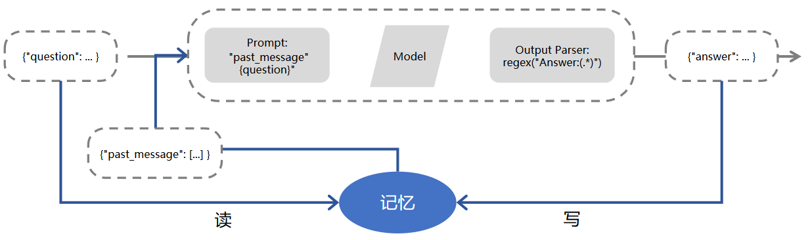

# 4.LangChain

### 1.LangChain?

LangChain 是一个基于语言模型的框架，用于构建聊天机器人、生成式问答（GQA）、摘要等功能。它的核心思想是将不同的组件“链”在一起，以创建更高级的语言模型应用。

LangChain 框架核心目标是**为了连接多种大语言模型**（如 OpenAI、LLaMA 等）\*\*和外部资源 \*\*（如 Google、Wikipedia、Notion 以及 Wolfram 等），**提供抽象和工具以在文本输入和输出之间进行接口处理**。大语言模型和组件通过“链（Chain）”连接，使得开发人员可以快速开发原型系统和 应用程序。

LangChain 的主要价值在于以下几个方面：&#x20;

1.  **组件化**：LangChain 框架提供了用于处理语言模型的抽象组件，以及每个抽象组件的一系列 实现。这些组件具有模块化设计，易于使用，无论是否使用 LangChain 框架的其他部分，都 可以方便地使用这些组件。
2.  **现成的链式组装**：LangChain 框架提供了一些现成的链式组装，用于完成特定的高级任务。这 些现成的链式组装使得入门变得更加容易。对于更复杂的应用程序，LangChain 框架也支持 自定义现有链式组装或构建新的链式组装。
3.  **简化开发难度**：通过提供组件化和现成的链式组装，LangChain 框架可以大大简化大语言模 型应用的开发难度。开发人员可以更专注于业务逻辑，而无需花费大量时间和精力处理底层 技术细节。

### 2. LangChain 包含哪些核心模块

LangChain 的提供了以下 6 种标准化、可扩展的接口并且可以外部集成的核心模块：

1.  **模型输 入/输出（Model I/O）**：与语言模型交互的接口；
2.  **数据连接（Data connection）**：与特定应用程序的数 据进行交互的接口；
3.  **链（Chains）**：用于复杂的应用的调用序列；
4.  **智能体（Agents）**：语言模型作为推理器决定要执行的动作序列；
5.  **记忆（Memory）**：用于链的多次运行之间持久化应用程序状态；
6.  **回调 （Callbacks）**：记录和流式传输任何链式组装的中间步骤。

#### 2.1 模型输入/输出（Model I/O）

LangChain 中模型输入/输出模块**是与各种大语言模型进行交互的基本组件，是大语言模型应 用的核心元素**。该模块的基本流程如图所示。

主要包含以下部分：**Prompts**、**Language Models** 以 及 **Output Parsers**。用户原始输入与模型和示例进行组合，然后输入给大语言模型，再根据大语言 模型的返回结果进行输出或者结构化处理。


**Prompts** 部分主要功能是提示词模板、提示词动态选择和输入管理。提示词是指输入模型的内容。该输入通常由模板、示例和用户输入的组合。LangChain 提供了几个类和函数，使得构建和处 理提示词更加容易。

```python
from langchain import PromptTemplate 
template = """ You are a naming consultant for new companies. What is a good name for a company that makes {product}? """ 

prompt = PromptTemplate.from_template(template) 
prompt.format(product="colorful socks")

```

**Language Models **部分提供了**与大语言模型的接口**，LangChain 提供了两种类型模型的接口和 集成：

-   **LLMs**，接受文本字符串作为输入并返回文本字符串；
-   **Chat Model**，由大语言模型支持，但接受 Chat Messages 列表作为输入并返回 Chat Message。

```python
from langchain.chat_models import ChatOpenAI 
from langchain.schema import (AIMessage, HumanMessage, SystemMessage) 

chat = ChatOpenAI(
  openai_api_key="...", 
  temperature=0, 
  model='gpt-3.5-turbo' 
) 

# HumanMessage 表示用户输入的消息，
# AIMessage 表示系统回复用户的消息，
# SystemMessage 表示设置的 AI 应该遵循的目标，
# ChatMessage 表示任务角色的消息。
messages = [
  SystemMessage(content="You are a helpful assistant."), 
  HumanMessage(content="Hi AI, how are you today?"), 
  AIMessage(content="I'm great thank you. How can I help you?"), 
  HumanMessage(content="I'd like to understand string theory.") 
] 

res = chat(messages) 
print(res.content)

```

**Output Parsers** 部分的目标是辅助开发者从大语言模型输出中获取比仅文本更结构化的信息。 Output Parsers 包含很多具体的实现，但是每个都必须实现如下两个必须实现的方法：

1.  获取格式化指令（Get format instructions），返回包含语言模型输出应如何格式化的字符串的方法；解析 （Parse）
2.  接受字符串（假设为语言模型的响应）并将其解析为某种结构的方法。以及一个可选 的方法：带提示解析（Parse with prompt），接受字符串（假设为语言模型的响应）和提示（假设 为生成此响应的提示）并将其解析为某种结构的方法。

#### 2.2 数据连接（Data Connection）

许多大语言模型应用需要用户特定的数据，这些数据不是模型的训练集的一部分。为了支持上述应用的构建，**LangChain 数据连接（Data connection）**模块**通过以下方式提供组件来加载、转换、存储和查询数据**：Document loaders、Document transformers、Text embedding models、Vector stores 以及 Retrievers。数据连接模块部分的基本框架如图所示。


**Document loaders（文档加载）** 旨在从源中加载数据构建 Document。LangChain 中 Document 是包含文本和与其关联的元数据。LangChain 中包含加载简单 txt 文件的文档加载器，用于加载任 何网页的文本内容的加载器，甚至还包含用于加载 YouTube 视频的转录稿的加载器。以下是一个 最简单的从文件中读取文本加载数据的 Document 的示例：

```python
from langchain.document_loaders import TextLoader

loader = TextLoader("./index.md")
loader.load()
```

**Document transformers（文档转换）** 旨在处理文档，以完成各种转换任务，如将文档格式化为 Q\&A 形式，去除文档中的冗余内容等，从而更好地满足不同应用程序的需求。

**Text embedding models （文本嵌入模型）** 旨在将非结构化文本转换为嵌入表示。基于文本的嵌入 表示，可以进行语义搜索，查找最相似的文本片段。LangChain 中的 Embeddings 类公开了两个方法：一个用于文档嵌入表示，另一个用于查询嵌入表示。前者输入多个文本，后 者输入单个文本。

**Vector Stores（向量存储）** 是存储和检索非结构化数据的主要方式之一。它首先将数据转化为 嵌入表示，然后存储这些生成的嵌入向量。在查询阶段，系统会利用这些嵌入向量来检索与查询内 容“最相似”的文档。向量存储的主要任务是保存这些嵌入数据并执行基于向量的搜索。LangChain 能够与多种向量数据库集成，如 Chroma、FAISS 和 Lance 等

**Retrievers（检索器）** 是一个接口，其功能是基于非结构化查询返回相应的文档

#### 2.3 链（Chain）

虽然独立使用大语言模型能够应对一些简单任务，但对于更加复杂的需求，可能**需要将多个大语言模型进行链式组合，或与其他组件进行链式调用**。LangChain 为这种“链式”应用提供了 Chain 接口，并将该接口定义得非常通用。作为一个调用组件的序列，还可以包含其他链。基本接 口非常简单，代码如下所示：

```python
class Chain(BaseModel, ABC): 
  """Base interface that all chains should implement.""" 
  
  memory: BaseMemory 
  callbacks: Callbacks 
  def __call__( 
    self, 
    inputs: Any, 
    return_only_outputs: bool = False, 
    callbacks: Callbacks = None,
  ) -> Dict[str, Any]: 
    ...
```

链允许将多个组件组合在一起，创建一个单一的、连贯的应用程序。

#### 2.4 记忆（Memory）

在 LangChain 中，这种**存储关于过去交互的信息的能力**被称为“记忆”（Memory）。LangChain 中提供了许多用于向系统添加记忆的方法，可以单独使用，也可以无缝地整合到链中。

LangChain 记忆模块的基本框架如图所示。记忆系统需要支持两个基本操作：**读取和写入**。 每个链都根据输入定义了核心执行逻辑。其中一些输入直接来自用户，但有些输入可以来源于记忆。在接收到初始用户输入，但在执行核心逻辑之前，链将从记忆系统中读取内容并增强用户输 入。在核心逻辑执行完毕并在返回答复之前，链会将这一轮的输入和输出都保存到记忆系统中，以 便在将来使用它们。



简单的形式，它只是将聊天消息列表保存到缓冲区中，并将其传递到提示模板中。代码示例如下 所示：

```python
from langchain.memory import ConversationBufferMemory 
memory = ConversationBufferMemory() 
memory.chat_memory.add_user_message("hi!") 
memory.chat_memory.add_ai_message("whats up?")
```

#### 2.5 智能体（Agents）

智能体的核心思想**是使用大语言模型来选择要执行的一系列动作**。在链中，操作序列是硬编码在代码中的。在智能体中，则是将大语言模型用作推理引擎，以确定要采取哪些动作以及以何种顺序采取这些动作。**智能体通过将大语言模型与动作列表结合，自动地选择最佳的动作序列，从 而实现自动化决策和行动**。智能体可以用于许多不同类型的应用程序，例如自动化客户服务、智 能家居等。LangChain 中智能体由如下几个核心组件构成：

-   `Agent`：是负责**决定下一步该采取什么步骤的类**。由大语言模型和提示驱动。提示可以包括 智能体的个性（有助于使其以某种方式做出回应）、智能体的背景上下文（有助于提供所要求 完成的任务类型的更多上下文信息）、激发更好的推理的提示策略（例如广泛使用的 ReAct）。&#x20;
-   `Tools`：是**智能体调用的函数**。这里有两个重要的考虑因素：1）为智能体提供正确的工具访 问权限；2）用对智能体最有帮助的方式描述工具。
-   `Toolkits`：是一组旨在一起使用以完成特定任务的工具集合，并具有方便的加载方法。通常一 个工具集中有 3-5 个工具。
-   `AgentExecutor`：是智能体的运行空间，这是实际调用智能体并执行其选择的操作的部分。除 了 AgentExecutor 类外，LangChain 还支持其他智能体运行空间，包括 Plan-and-execute Agent、 Baby AGI、Auto GPT 等。

#### 2.6 回调（Callbacks）

LangChain 提供了回调系统，**允许连接到大语言模型应用程序的各个阶段**。这对于日志记录、 监控、流式处理和其他任务非常有用。可以通过使用 API 中提供的 callbacks 参数订阅这些事件。 CallbackHandlers 是实现 CallbackHandler 接口的对象，每个事件都可以通过一个方法订阅。当事件 触发时，CallbackManager 会调用相应事件所对应的处理程序。
