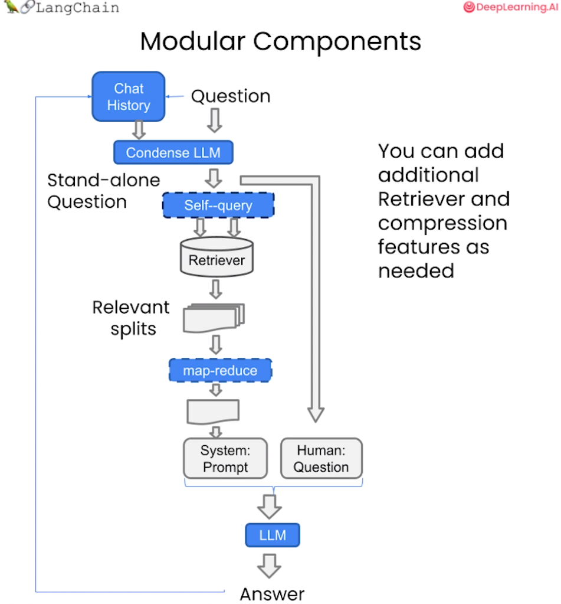

# 5.基于问答的Prompt构建

在前面的章节，已经介绍了根据本地知识文档，搭建一个向量知识库。 下面，**将使用搭建好的向量数据库，对 query 查询问题进行召回，并将召回结果和 query 结合起来构建 prompt，输入到大模型中进行问答**。

## 1.加载向量数据库

```python
from langchain.vectorstores import Chroma
from langchain.embeddings.openai import OpenAIEmbeddings    # 调用 OpenAI 的 Embeddings 模型
import openai
from dotenv import load_dotenv, find_dotenv
import os

_ = load_dotenv(find_dotenv()) # read local .env file
openai.api_key = os.environ['OPENAI_API_KEY']

```

加载本地向量数据库，其中包含多个文档的Embedding

```python
# 定义 Embeddings
embedding = OpenAIEmbeddings() 

# 向量数据库持久化路径
persist_directory = 'database/vector_zhipuai_db/chroma'

# 加载数据库
vectordb = Chroma(
    persist_directory=persist_directory,  # 允许我们将persist_directory目录保存到磁盘上
    embedding_function=embedding
)

```

```python
print(f"向量库中存储的数量：{vectordb._collection.count()}")
```

可以测试一下加载的向量数据库，使用一个问题 query 进行向量检索。如下代码会在向量数据库中**根据相似性进行检索，返回前 k 个最相似的文档**。

```python
question = "什么是C++"
docs = vectordb.similarity_search(question,k=3)
print(f"检索到的内容数：{len(docs)}")
```

```python
# 打印检索内容
for i, doc in enumerate(docs):
    print(f"检索到的第{i}个内容: \n {doc.page_content[:200]}", end="\n--------------\n")
```

## 2.创建LLM

在这里，调用LangChain封装的LLM类

```python
from zhipuai_llm import ZhipuAILLM

llm = ZhipuAILLM(model="chatglm_pro", 
                 zhipuai_api_key=api_key, 
                 temperature=0.1)
llm("你是谁") 
```

## 3.构建Prompt

```python
from langchain.prompts import PromptTemplate

# template = """基于以下已知信息，简洁和专业的来回答用户的问题。
#             如果无法从中得到答案，请说 "根据已知信息无法回答该问题" 或 "没有提供足够的相关信息"，不允许在答案中添加编造成分。
#             答案请使用中文。
#             总是在回答的最后说“谢谢你的提问！”。
# 已知信息：{context}
# 问题: {question}"""
template = """使用以下上下文来回答最后的问题。如果你不知道答案，就说你不知道，不要试图编造答
案。最多使用三句话。尽量使答案简明扼要。总是在回答的最后说“谢谢你的提问！”。
{context}
问题: {question}
有用的回答:"""

QA_CHAIN_PROMPT = PromptTemplate(input_variables=["context","question"],
                                 template=template)

# 运行 chain
```

再创建一个基于模板的检索链：

```python
from langchain.chains import RetrievalQA

qa_chain = RetrievalQA.from_chain_type(llm,
                                       retriever=vectordb.as_retriever(),
                                       return_source_documents=True,
                                       chain_type_kwargs={"prompt":QA_CHAIN_PROMPT})
```

创建检索 QA 链的方法 `RetrievalQA.from_chain_type()` 有如下参数：

-   `llm`：指定使用的 LLM
-   指定 `chain type` : `RetrievalQA.from_chain_type(chain_type="map_reduce")`，也可以利用`load_qa_chain()`方法指定chain type。
-   自定义 `prompt `：通过在`RetrievalQA.from_chain_type()`方法中，指定`chain_type_kwargs`参数，而该参数：`chain_type_kwargs = {"prompt": PROMPT}`
-   返回源文档：通过`RetrievalQA.from_chain_type(`)方法中指定：`return_source_documents=True`参数；也可以使用`RetrievalQAWithSourceChain()`方法，返回源文档的引用（坐标或者叫主键、索引）

## 4.添加历史对话记忆功能

现在已经实现了通过上传本地知识文档，然后将它们保存到向量知识库，通过将查询问题与向量知识库的召回结果进行结合输入到 LLM 中，就得到了一个相比于直接让 LLM 回答要好得多的结果。在与语言模型交互时，可能已经注意到一个关键问题 - **它们并不记得你之前的交流内容**。这在构建一些应用程序（如聊天机器人）的时候，带来了很大的挑战，使得对话似乎缺乏真正的连续性。这个问题该如何解决呢？

### 4.1 记忆

LangChain 中的储存模块，即将先前的对话嵌入到语言模型中的，使其具有连续对话的能力。使用 `ConversationBufferMemory` ，它保存聊天消息历史记录的列表，这些历史记录将在回答问题时与问题一起传递给聊天机器人，从而将它们添加到上下文中。

```python
from langchain.memory import ConversationBufferMemory

memory = ConversationBufferMemory(
    memory_key="chat_history",  # 与 prompt 的输入变量保持一致。
    return_messages=True  # 将以消息列表的形式返回聊天记录，而不是单个字符串
)
```

### 4.2 对话检索链（ConversationalRetrievalChain）

对话检索链（ConversationalRetrievalChain）在检索 QA 链的基础上，增加了处理对话历史的能力。

它的工作流程是:

1.  将之前的对话与新问题合并生成一个完整的查询语句。
2.  在向量数据库中搜索该查询的相关文档。
3.  获取结果后，存储所有答案到对话记忆区。
4.  用户可在 UI 中查看完整的对话流程。



这种链式方式将新问题放在之前对话的语境中进行检索，可以处理依赖历史信息的查询。并保留所有信 息在对话记忆中，方便追踪。

接下来让可以测试这个对话检索链的效果：

先加载向量数据库和 LLM ！

```python
from langchain.vectorstores import Chroma
from langchain.embeddings.openai import OpenAIEmbeddings    # 调用 OpenAI 的 Embeddings 模型
import openai
from dotenv import load_dotenv, find_dotenv
import os

_ = load_dotenv(find_dotenv()) # read local .env file
openai.api_key = os.environ['OPENAI_API_KEY']

# 定义 Embeddings
embedding = OpenAIEmbeddings() 
# 向量数据库持久化路径
persist_directory = 'database/vector_zhipuai_db/chroma'
# 加载数据库
vectordb = Chroma(
    persist_directory=persist_directory,  # 允许我们将persist_directory目录保存到磁盘上
    embedding_function=embedding
)

# 创建LLM
from zhipuai_llm import ZhipuAILLM
llm = ZhipuAILLM(model="chatglm_pro", 
                 zhipuai_api_key=api_key, 
                 temperature=0.1)
```

对话检索链：

```python
from langchain.chains import ConversationalRetrievalChain

retriever=vectordb.as_retriever()

qa = ConversationalRetrievalChain.from_llm(
    llm,
    retriever=retriever,
    memory=memory
)
question = "我可以学习到关于编程语言的知识吗？"
result = qa({"question": question})
print(result['answer'])
```


